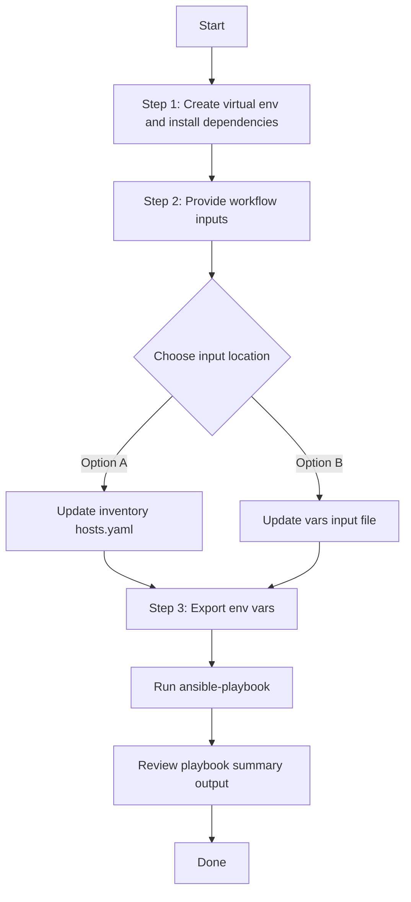

# Access Point Config Generator

## Table of Contents

- [User Flow (3 Steps)](#user-flow-3-steps)
- [Overview](#overview)
- [Features](#features)
- [Prerequisites](#prerequisites)
- [Workflow Structure](#workflow-structure)
- [Schema Parameters](#schema-parameters)
- [Getting Started](#getting-started)
- [Operations](#operations)
- [Examples](#examples)

## Overview

The Access Point config generator automates YAML playbook generation for existing access point configurations in Cisco Catalyst Center. It generates output compatible with `accesspoint_workflow_manager`.

---

## Features

- **Configuration Generation**: Generate YAML configurations compatible with `accesspoint_workflow_manager`.
  - Extract configured and provisioned AP settings from Catalyst Center.
  - Convert API responses into workflow-manager-ready YAML.
  - Reuse generated files for backup and migration.
- **Global Filtering**: Filter by site hierarchies, provisioned AP hostnames, AP config hostnames, combined provision/config hostnames, and MAC addresses.
- **Priority-based Selection**: Module applies highest-priority filter when multiple are provided.
- **Flexible Output**: Supports custom `file_path` and `file_mode` (`overwrite` / `append`).
- **Brownfield Discovery**: Omit `config` (or use workflow convenience flag) to generate all AP configurations.

---

## Prerequisites

### Software Requirements

| Component                       | Version  |
| ------------------------------- | -------- |
| Ansible                         | 2.13+    |
| cisco.catalystcenter collection | 2.6.0    |
| Python                          | 3.9+     |
| Cisco Catalyst Center           | 2.3.5.3+ |
| catalystcentersdk               | 2.10.10+ |

### Required Collections

```bash
ansible-galaxy collection install cisco.catalystcenter
ansible-galaxy collection install ansible.utils
pip install catalystcentersdk
pip install yamale
```

### Access Requirements

- Catalyst Center credentials with AP and site API access
- Network connectivity to Catalyst Center
- Existing AP data for targeted export use cases

---

## Workflow Structure

```
accesspoint_config_generator/
├── playbook/
│   └── accesspoint_config_generator.yml             # Main operations
├── vars/
│   └── accesspoint_config_inputs.yml                # Input examples
├── schema/
│   └── accesspoint_config_schema.yml                # Input validation
└── README.md
```

---

## Schema Parameters

### Basic Configuration

| Parameter                       | Type    | Required | Default        | Description                                                               |
| ------------------------------- | ------- | -------- | -------------- | ------------------------------------------------------------------------- |
| `generate_all_configurations` | boolean | No       | false          | Workflow convenience flag. When true, the playbook omits module`config` |
| `file_path`                   | string  | No       | auto-generated | Output file path for generated YAML                                       |
| `file_mode`                   | string  | No       | `overwrite`  | File write mode:`overwrite` or `append`                               |
| `global_filters`              | dict    | No       | omitted        | Workflow convenience wrapper mapped to module`config.global_filters`    |

### Global Filters

- `site_list`
- `provision_hostname_list`
- `accesspoint_config_list`
- `accesspoint_provision_config_list`
- `accesspoint_provision_config_mac_list`

Module filter priority:

- `site_list` > `provision_hostname_list` > `accesspoint_config_list` > `accesspoint_provision_config_list` > `accesspoint_provision_config_mac_list`

---

## Getting Started

## Workflow Steps

## User Flow (3 Steps)



### Installation and Run

> Run all commands from **your own test project** (not from inside the collection source tree). Every file path below must be an **absolute path** on your machine. The playbook, inventory, vars, and schema files can live in different directories — always pass each one as a full absolute path.
>
> Placeholders used in the examples below (replace each with the actual absolute path on your system):
>
> - `/<abs-path-to-inventory>/hosts.yaml` — your inventory file
> - `/<abs-path-to-playbook>/accesspoint_config_generator.yml` — the playbook file
> - `/<abs-path-to-vars>/accesspoint_config_inputs.yml` — your input vars file
> - `/<abs-path-to-schema>/accesspoint_config_schema.yml` — the schema file
> - `/<abs-path-to-collection>/tools/schemavalidation.sh` — schema validation helper

1. Create and activate a Python virtual environment, then install dependencies.

```bash
python3 -m venv /<abs-path-to-your-project>/.venv
source /<abs-path-to-your-project>/.venv/bin/activate
pip install -r /<abs-path-to-your-project>/requirements.txt
ansible-galaxy collection install cisco.catalystcenter --force
```

2. Provide workflow inputs in either your inventory file (`/<abs-path-to-inventory>/hosts.yaml`) or your vars input file (`/<abs-path-to-vars>/accesspoint_config_inputs.yml`).
3. Export Catalyst Center environment variables and run the playbook.

```bash
export HOSTIP=<catalyst-center-ip-or-fqdn>
export CATALYST_CENTER_USERNAME=<username>
export CATALYST_CENTER_PASSWORD='<password>'

ansible-playbook \
  -i /<abs-path-to-inventory>/hosts.yaml \
  /<abs-path-to-playbook>/accesspoint_config_generator.yml \
  -vvvv
```

Or pass the vars input file explicitly via `--extra-vars VARS_FILE_PATH=...` (must be an absolute path):

```bash
ansible-playbook \
  -i /<abs-path-to-inventory>/hosts.yaml \
  /<abs-path-to-playbook>/accesspoint_config_generator.yml \
  --extra-vars VARS_FILE_PATH=/<abs-path-to-vars>/accesspoint_config_inputs.yml \
  -vvvv
```

> Always pass `VARS_FILE_PATH` as an **absolute path**. The playbook and the vars file may live in different directories in your project, so relative paths are not supported by this documentation.

## Validate Input (Schema & Vars Validation)

Before running the playbook, validate the input file against the schema using the `schemavalidation.sh` helper (a wrapper around `yamale`). Pass absolute paths for both arguments:

- `-s` : absolute path to the schema file
- `-v` : absolute path to the vars (input) file

```bash
/<abs-path-to-collection>/tools/schemavalidation.sh \
  -s /<abs-path-to-schema>/accesspoint_config_schema.yml \
  -v /<abs-path-to-vars>/accesspoint_config_inputs.yml
```

Expected output:

```bash
(pyats) bash-4.4$ /<abs-path-to-collection>/tools/schemavalidation.sh \
  -s /<abs-path-to-schema>/accesspoint_config_schema.yml \
  -v /<abs-path-to-vars>/accesspoint_config_inputs.yml
/<abs-path-to-schema>/accesspoint_config_schema.yml
/<abs-path-to-vars>/accesspoint_config_inputs.yml
yamale  -s /<abs-path-to-schema>/accesspoint_config_schema.yml  /<abs-path-to-vars>/accesspoint_config_inputs.yml
Validating /<abs-path-to-vars>/accesspoint_config_inputs.yml...
Validation success! 👍
```

If `yamale` is not installed in your active environment:

```bash
pip install yamale
```

## Operations

### Generate Operations (state: gathered)

1. **Generate all AP configurations**

- Set `generate_all_configurations: true`, or omit `global_filters` entirely.

2. **Generate by site list**

- Use `global_filters.site_list`.

3. **Generate by AP hostname filters**

- Use `global_filters.provision_hostname_list` or `global_filters.accesspoint_config_list`.

4. **Generate by combined hostname/MAC filters**

- Use `global_filters.accesspoint_provision_config_list` or `global_filters.accesspoint_provision_config_mac_list`.

---

## Examples

### Example 1: Generate all AP configurations

```yaml
accesspoint_config:
  - generate_all_configurations: true
    file_path: "/tmp/accesspoint_complete_config.yml"
```

### Example 2: Filter by provisioned AP hostnames

```yaml
accesspoint_config:
  - file_path: "/tmp/accesspoint_by_provision_hostname.yml"
    global_filters:
      provision_hostname_list: ["test_ap_1", "test_ap_2"]
```

### Example 3: Filter by AP MAC addresses

```yaml
accesspoint_config:
  - file_path: "/tmp/accesspoint_by_mac.yml"
    global_filters:
      accesspoint_provision_config_mac_list: ["a4:88:73:d4:dd:80"]
```

---

## Notes

- `accesspoint_playbook_config_generator` expects `config.global_filters` when filtering is used.
- This workflow omits module `config` when `generate_all_configurations: true` is set or when `global_filters` is omitted or empty.
- Run all commands from your own test project and always supply **absolute paths** for the inventory, playbook, vars, schema, and `VARS_FILE_PATH`. Relative paths are intentionally not documented because the playbook and the vars file may live in different directories on a customer's system.
