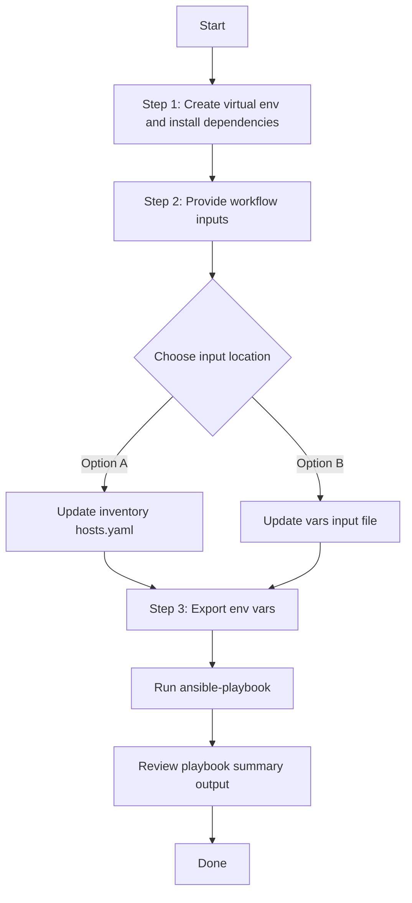

# Access Point Config Generator

## Table of Contents

- [User Flow (3 Steps)](#user-flow-3-steps)
- [Overview](#overview)
- [Features](#features)
- [Prerequisites](#prerequisites)
- [Workflow Structure](#workflow-structure)
- [Schema Parameters](#schema-parameters)
- [Getting Started](#getting-started)
- [Operations](#operations)
- [Examples](#examples)

## Overview

The Access Point config generator automates YAML playbook generation for existing access point configurations in Cisco Catalyst Center. It generates output compatible with `accesspoint_workflow_manager`.

---

## Features

- **Configuration Generation**: Generate YAML configurations compatible with `accesspoint_workflow_manager`.
  - Extract configured and provisioned AP settings from Catalyst Center.
  - Convert API responses into workflow-manager-ready YAML.
  - Reuse generated files for backup and migration.
- **Global Filtering**: Filter by site hierarchies, provisioned AP hostnames, AP config hostnames, combined provision/config hostnames, and MAC addresses.
- **Priority-based Selection**: Module applies highest-priority filter when multiple are provided.
- **Flexible Output**: Supports custom `file_path` and `file_mode` (`overwrite` / `append`).
- **Brownfield Discovery**: Omit `config` (or use workflow convenience flag) to generate all AP configurations.

---

## Prerequisites

### Software Requirements

| Component                       | Version  |
| ------------------------------- | -------- |
| Ansible                         | 2.13+    |
| cisco.catalystcenter collection | 2.6.0    |
| Python                          | 3.9+     |
| Cisco Catalyst Center           | 2.3.5.3+ |
| catalystcentersdk               | 2.10.10+ |

### Required Collections

```bash
ansible-galaxy collection install cisco.catalystcenter
ansible-galaxy collection install ansible.utils
pip install catalystcentersdk
pip install yamale
```

### Access Requirements

- Catalyst Center credentials with AP and site API access
- Network connectivity to Catalyst Center
- Existing AP data for targeted export use cases

---

## Workflow Structure

```
accesspoint_config_generator/
├── playbook/
│   └── accesspoint_config_generator.yml             # Main operations
├── vars/
│   └── accesspoint_config_inputs.yml                # Input examples
├── schema/
│   └── accesspoint_config_schema.yml                # Input validation
└── README.md
```

---

## Schema Parameters

### Basic Configuration

| Parameter                       | Type    | Required | Default        | Description                                                               |
| ------------------------------- | ------- | -------- | -------------- | ------------------------------------------------------------------------- |
| `generate_all_configurations` | boolean | No       | false          | Workflow convenience flag. When true, the playbook omits module`config` |
| `file_path`                   | string  | No       | auto-generated | Output file path for generated YAML                                       |
| `file_mode`                   | string  | No       | `overwrite`  | File write mode:`overwrite` or `append`                               |
| `global_filters`              | dict    | No       | omitted        | Workflow convenience wrapper mapped to module`config.global_filters`    |

### Global Filters

- `site_list`
- `provision_hostname_list`
- `accesspoint_config_list`
- `accesspoint_provision_config_list`
- `accesspoint_provision_config_mac_list`

Module filter priority:

- `site_list` > `provision_hostname_list` > `accesspoint_config_list` > `accesspoint_provision_config_list` > `accesspoint_provision_config_mac_list`

---

## Getting Started

## Workflow Steps

## User Flow (3 Steps)



### Installation and Run

> Run all commands from **your own test project** (not from inside the collection source tree). Instead of hard-coding paths, define a few environment variables once, then copy-paste the commands below without editing.

#### Step 0: Define reusable path variables (one time per shell)

Set these once at the top of your shell session. Every command in this guide will use them, so you don't need to edit any paths later.

```bash
# Root of your test project (change this to your actual project directory)
export PROJECT_DIR="$HOME/my-catc-project"

# Root of the cisco.catalystcenter collection (contains tools/schemavalidation.sh)
export COLLECTION_DIR="$HOME/catalystcenter-ansible"

# Workflow input/config files (all resolved from PROJECT_DIR by default)
export INVENTORY_PATH="$PROJECT_DIR/inventory/hosts.yaml"
export PLAYBOOK_PATH="$PROJECT_DIR/playbook/accesspoint_config_generator.yml"
export VARS_FILE_PATH="$PROJECT_DIR/vars/accesspoint_config_inputs.yml"
export SCHEMA_FILE_PATH="$PROJECT_DIR/schema/accesspoint_config_schema.yml"
```

> Tip: Save these `export` lines in a file like `env.sh` inside your project, then run `source env.sh` at the start of each session.

#### Step 1: Create a Python virtual environment and install dependencies

```bash
python3 -m venv .venv
source .venv/bin/activate
pip install catalystcentersdk
ansible-galaxy collection install cisco.catalystcenter --force
```

#### Step 2: Provide workflow inputs

Edit either your inventory file (`$INVENTORY_PATH`) or your vars input file (`$VARS_FILE_PATH`) to provide the workflow inputs.

#### Step 3: Export Catalyst Center credentials and run the playbook

```bash
export HOSTIP=<catalyst-center-ip-or-fqdn>
export CATALYST_CENTER_USERNAME=<username>
export CATALYST_CENTER_PASSWORD='<password>'

ansible-playbook \
  -i "$INVENTORY_PATH" \
  "$PLAYBOOK_PATH" \
  -vvvv
```

Or pass the vars input file explicitly via `--extra-vars`:

```bash
ansible-playbook \
  -i "$INVENTORY_PATH" \
  "$PLAYBOOK_PATH" \
  --extra-vars "VARS_FILE_PATH=$VARS_FILE_PATH" \
  -vvvv
```

> The `VARS_FILE_PATH` variable is already an absolute path from Step 0, so no further editing is needed.

## Validate Input (Schema & Vars Validation)

Before running the playbook, validate the input file against the schema using the `schemavalidation.sh` helper (a wrapper around `yamale`). It uses the variables defined in Step 0:

- `-s` : path to the schema file (`$SCHEMA_FILE_PATH`)
- `-v` : path to the vars input file (`$VARS_FILE_PATH`)

```bash
"$COLLECTION_DIR/tools/schemavalidation.sh" \
  -s "$SCHEMA_FILE_PATH" \
  -v "$VARS_FILE_PATH"
```

Expected output:

```bash
(pyats) bash-4.4$ "$COLLECTION_DIR/tools/schemavalidation.sh" \
  -s "$SCHEMA_FILE_PATH" \
  -v "$VARS_FILE_PATH"
$SCHEMA_FILE_PATH
$VARS_FILE_PATH
yamale  -s $SCHEMA_FILE_PATH  $VARS_FILE_PATH
Validating $VARS_FILE_PATH...
Validation success! 👍
```

If `yamale` is not installed in your active environment:

```bash
pip install yamale
```

## Operations

### Generate Operations (state: gathered)

1. **Generate all AP configurations**

- Set `generate_all_configurations: true`, or omit `global_filters` entirely.

2. **Generate by site list**

- Use `global_filters.site_list`.

3. **Generate by AP hostname filters**

- Use `global_filters.provision_hostname_list` or `global_filters.accesspoint_config_list`.

4. **Generate by combined hostname/MAC filters**

- Use `global_filters.accesspoint_provision_config_list` or `global_filters.accesspoint_provision_config_mac_list`.

---

## Examples

### Example 1: Generate all AP configurations

```yaml
accesspoint_config:
  - generate_all_configurations: true
    file_path: "/tmp/accesspoint_complete_config.yml"
```

### Example 2: Filter by provisioned AP hostnames

```yaml
accesspoint_config:
  - file_path: "/tmp/accesspoint_by_provision_hostname.yml"
    global_filters:
      provision_hostname_list: ["test_ap_1", "test_ap_2"]
```

### Example 3: Filter by AP MAC addresses

```yaml
accesspoint_config:
  - file_path: "/tmp/accesspoint_by_mac.yml"
    global_filters:
      accesspoint_provision_config_mac_list: ["a4:88:73:d4:dd:80"]
```

---

## Notes

- `accesspoint_playbook_config_generator` expects `config.global_filters` when filtering is used.
- This workflow omits module `config` when `generate_all_configurations: true` is set or when `global_filters` is omitted or empty.
- Run all commands from your own test project. Define the path variables from [Step 0](#step-0-define-reusable-path-variables-one-time-per-shell) once per shell (or `source` them from a saved `env.sh`), then copy-paste the commands as-is — no manual path editing required.
