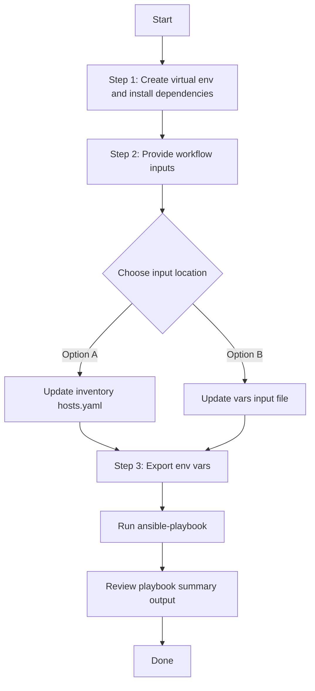

# Utility to maintain Ansible Vault, Add/Delete existing Variables and new variables in ansible vault
This workflow to maintain the Ansible Vault and Variables in Ansible Vault

TO encrypt a variable and store it in Vault file for hiding the actual value in the Ansible inputs. 
Provide the variables in vars/ansible_vault_update_inputs.yaml

## Adding new keys with values to ansible vault
Any variabe can be encrypted and stored in the ansible vault using key/value keys as in the example below.

---
passwords_details:
- password_key: testuser1password
  password_value: 'testuser1@123'
- password_key: testuser2password
  password_value: 'testuser2@123'

Execute the playbook to store new keys with encrypted values in the ansible vault. Then reference the variable directly in your ansible imput using the {{variable}} reference the value. Ansible at time of execution will decode and replace the original value.

## to update the existing the key to new vale simply run update the input with new value and run the playbook 
---
passwords_details:
- password_key: testuser1password
  password_value: 'testuser1@123!!123'  #Updated
- password_key: testuser2password
  password_value: 'testuser2@123'

## Workflow Steps
## User Flow (3 Steps)



### Installation and Run

> Run all commands from **your own test project** (not from inside the collection source tree). Every file path below must be an **absolute path** on your machine. The playbook, inventory, vars, and schema files can live in different directories — always pass each one as a full absolute path.
>
> Placeholders used in the examples below (replace each with the actual absolute path on your system):
>
> - `/<abs-path-to-inventory>/hosts.yaml` — your inventory file
> - `/<abs-path-to-playbook>/ansible_vault_update_playbook.yml` — the playbook file (use `delete_ansible_vault_update_playbook.yml` to remove variables)
> - `/<abs-path-to-vars>/ansible_vault_update_inputs.yml` — your input vars file
> - `/<abs-path-to-schema>/ansible_vault_update_schema.yml` — the schema file
> - `/<abs-path-to-collection>/tools/schemavalidation.sh` — schema validation helper

1. Create and activate a Python virtual environment, then install dependencies.

```bash
python3 -m venv /<abs-path-to-your-project>/.venv
source /<abs-path-to-your-project>/.venv/bin/activate
pip install -r /<abs-path-to-your-project>/requirements.txt
ansible-galaxy collection install cisco.catalystcenter --force
```

2. Provide workflow inputs in either your inventory file (`/<abs-path-to-inventory>/hosts.yaml`) or your vars input file (`/<abs-path-to-vars>/ansible_vault_update_inputs.yml`).

3. Export Catalyst Center environment variables and run the playbook.

```bash
export HOSTIP=<catalyst-center-ip-or-fqdn>
export CATALYST_CENTER_USERNAME=<username>
export CATALYST_CENTER_PASSWORD='<password>'

ansible-playbook \
  -i /<abs-path-to-inventory>/hosts.yaml \
  /<abs-path-to-playbook>/ansible_vault_update_playbook.yml \
  -vvvv
```

Or pass the vars input file explicitly via `--extra-vars VARS_FILE_PATH=...` (must be an absolute path):

```bash
ansible-playbook \
  -i /<abs-path-to-inventory>/hosts.yaml \
  /<abs-path-to-playbook>/ansible_vault_update_playbook.yml \
  --extra-vars VARS_FILE_PATH=/<abs-path-to-vars>/ansible_vault_update_inputs.yml \
  -vvvv
```

> Always pass `VARS_FILE_PATH` as an **absolute path**. The playbook and the vars file may live in different directories in your project, so relative paths are not supported by this documentation.

## Executing the playbook to add variables and encrypt to the playbook

```bash
ansible-playbook \
  -i /<abs-path-to-inventory>/hosts.yaml \
  /<abs-path-to-playbook>/ansible_vault_update_playbook.yml \
  --extra-vars VARS_FILE_PATH=/<abs-path-to-vars>/ansible_vault_update_inputs.yml
```

## Removing variables from ansible vault

```bash
ansible-playbook \
  -i /<abs-path-to-inventory>/hosts.yaml \
  /<abs-path-to-playbook>/delete_ansible_vault_update_playbook.yml \
  --extra-vars VARS_FILE_PATH=/<abs-path-to-vars>/ansible_vault_update_inputs.yml
```

## Validate Input (Schema & Vars Validation)

Before running the playbook, validate the input file against the schema using the `schemavalidation.sh` helper (a wrapper around `yamale`). Pass absolute paths for both arguments:

- `-s` : absolute path to the schema file
- `-v` : absolute path to the vars (input) file

```bash
/<abs-path-to-collection>/tools/schemavalidation.sh \
  -s /<abs-path-to-schema>/ansible_vault_update_schema.yml \
  -v /<abs-path-to-vars>/ansible_vault_update_inputs.yml
```

Expected output:

```bash
(pyats) bash-4.4$ /<abs-path-to-collection>/tools/schemavalidation.sh \
  -s /<abs-path-to-schema>/ansible_vault_update_schema.yml \
  -v /<abs-path-to-vars>/ansible_vault_update_inputs.yml
/<abs-path-to-schema>/ansible_vault_update_schema.yml
/<abs-path-to-vars>/ansible_vault_update_inputs.yml
yamale  -s /<abs-path-to-schema>/ansible_vault_update_schema.yml  /<abs-path-to-vars>/ansible_vault_update_inputs.yml
Validating /<abs-path-to-vars>/ansible_vault_update_inputs.yml...
Validation success! 👍
```

If `yamale` is not installed in your active environment:

```bash
pip install yamale
```

## Inventory / group_vars Example

You can also run this workflow without `VARS_FILE_PATH` by moving the sample workflow data into inventory, `host_vars`, or `group_vars`.

1. Create an inventory vars file such as `/<abs-path-to-inventory>/group_vars/all.yml` or `/<abs-path-to-inventory>/host_vars/<host>.yml`.
2. Copy the sample workflow data from `/<abs-path-to-vars>/ansible_vault_update_inputs.yml` into that inventory vars file.
3. Keep the same top-level variable name in inventory: `passwords_details`.
4. Run the playbook without `VARS_FILE_PATH` (still using absolute paths):

```bash
ansible-playbook \
  -i /<abs-path-to-inventory>/hosts.yaml \
  /<abs-path-to-playbook>/ansible_vault_update_playbook.yml \
  -vvvv
```

## VARS_FILE_PATH

Always pass `VARS_FILE_PATH` as an **absolute path**, for example:

```
/<abs-path-to-vars>/ansible_vault_update_inputs.yml
```

Relative paths are intentionally not documented — the playbook and the vars file may live in different directories on a customer's system, so absolute paths are the only supported form.


