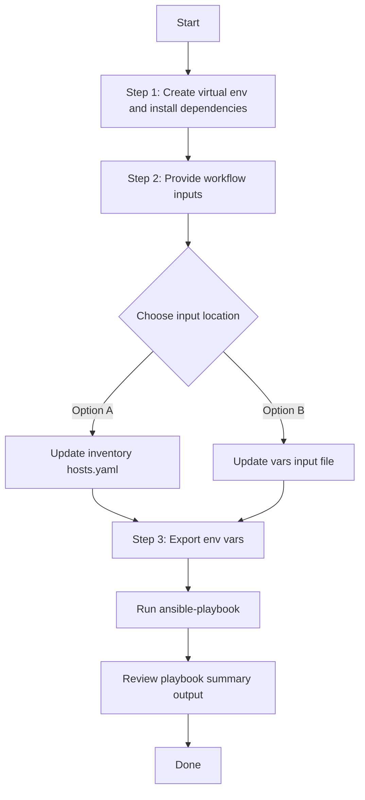

# Utility to maintain Ansible Vault, Add/Delete existing Variables and new variables in ansible vault
This workflow to maintain the Ansible Vault and Variables in Ansible Vault

TO encrypt a variable and store it in Vault file for hiding the actual value in the Ansible inputs. 
Provide the variables in vars/ansible_vault_update_inputs.yaml

## Adding new keys with values to ansible vault
Any variabe can be encrypted and stored in the ansible vault using key/value keys as in the example below.

---
passwords_details:
- password_key: testuser1password
  password_value: 'testuser1@123'
- password_key: testuser2password
  password_value: 'testuser2@123'

Execute the playbook to store new keys with encrypted values in the ansible vault. Then reference the variable directly in your ansible imput using the {{variable}} reference the value. Ansible at time of execution will decode and replace the original value.

## to update the existing the key to new vale simply run update the input with new value and run the playbook 
---
passwords_details:
- password_key: testuser1password
  password_value: 'testuser1@123!!123'  #Updated
- password_key: testuser2password
  password_value: 'testuser2@123'

## Workflow Steps
## User Flow (3 Steps)



### Installation and Run

> Run all commands from **your own test project** (not from inside the collection source tree). Instead of hard-coding paths, define a few environment variables once, then copy-paste the commands below without editing.

#### Step 0: Define reusable path variables (one time per shell)

Set these once at the top of your shell session. Every command in this guide will use them, so you don't need to edit any paths later.

```bash
# Root of your test project (change this to your actual project directory)
export PROJECT_DIR="$HOME/my-catc-project"

# Root of the cisco.catalystcenter collection (contains tools/schemavalidation.sh)
export COLLECTION_DIR="$HOME/catalystcenter-ansible"

# Workflow input/config files (all resolved from PROJECT_DIR by default)
export INVENTORY_PATH="$PROJECT_DIR/inventory/hosts.yaml"
export PLAYBOOK_PATH="$PROJECT_DIR/playbook/ansible_vault_update_playbook.yml"
export DELETE_PLAYBOOK_PATH="$PROJECT_DIR/playbook/delete_ansible_vault_update_playbook.yml"
export VARS_FILE_PATH="$PROJECT_DIR/vars/ansible_vault_update_inputs.yml"
export SCHEMA_FILE_PATH="$PROJECT_DIR/schema/ansible_vault_update_schema.yml"
```

> Tip: Save these `export` lines in a file like `env.sh` inside your project, then run `source env.sh` at the start of each session.

#### Step 1: Create a Python virtual environment and install dependencies

```bash
python3 -m venv "$PROJECT_DIR/.venv"
source "$PROJECT_DIR/.venv/bin/activate"
pip install -r "$PROJECT_DIR/requirements.txt"
ansible-galaxy collection install cisco.catalystcenter --force
```

#### Step 2: Provide workflow inputs

Edit either your inventory file (`$INVENTORY_PATH`) or your vars input file (`$VARS_FILE_PATH`) to provide the workflow inputs.

#### Step 3: Export Catalyst Center credentials and run the playbook

```bash
export HOSTIP=<catalyst-center-ip-or-fqdn>
export CATALYST_CENTER_USERNAME=<username>
export CATALYST_CENTER_PASSWORD='<password>'

ansible-playbook \
  -i "$INVENTORY_PATH" \
  "$PLAYBOOK_PATH" \
  -vvvv
```

Or pass the vars input file explicitly via `--extra-vars`:

```bash
ansible-playbook \
  -i "$INVENTORY_PATH" \
  "$PLAYBOOK_PATH" \
  --extra-vars "VARS_FILE_PATH=$VARS_FILE_PATH" \
  -vvvv
```

> The `VARS_FILE_PATH` variable is already an absolute path from Step 0, so no further editing is needed.

## Executing the playbook to add variables and encrypt to the playbook

```bash
ansible-playbook \
  -i "$INVENTORY_PATH" \
  "$PLAYBOOK_PATH" \
  --extra-vars "VARS_FILE_PATH=$VARS_FILE_PATH"
```

## Removing variables from ansible vault

```bash
ansible-playbook \
  -i "$INVENTORY_PATH" \
  "$DELETE_PLAYBOOK_PATH" \
  --extra-vars "VARS_FILE_PATH=$VARS_FILE_PATH"
```

## Validate Input (Schema & Vars Validation)

Before running the playbook, validate the input file against the schema using the `schemavalidation.sh` helper (a wrapper around `yamale`). It uses the variables defined in Step 0:

- `-s` : path to the schema file (`$SCHEMA_FILE_PATH`)
- `-v` : path to the vars input file (`$VARS_FILE_PATH`)

```bash
"$COLLECTION_DIR/tools/schemavalidation.sh" \
  -s "$SCHEMA_FILE_PATH" \
  -v "$VARS_FILE_PATH"
```

Expected output:

```bash
(pyats) bash-4.4$ "$COLLECTION_DIR/tools/schemavalidation.sh" \
  -s "$SCHEMA_FILE_PATH" \
  -v "$VARS_FILE_PATH"
$SCHEMA_FILE_PATH
$VARS_FILE_PATH
yamale  -s $SCHEMA_FILE_PATH  $VARS_FILE_PATH
Validating $VARS_FILE_PATH...
Validation success! 👍
```

If `yamale` is not installed in your active environment:

```bash
pip install yamale
```

## Inventory / group_vars Example

You can also run this workflow without `VARS_FILE_PATH` by moving the sample workflow data into inventory, `host_vars`, or `group_vars`.

1. Create an inventory vars file such as `$PROJECT_DIR/inventory/group_vars/all.yml` or `$PROJECT_DIR/inventory/host_vars/<host>.yml`.
2. Copy the sample workflow data from `$VARS_FILE_PATH` into that inventory vars file.
3. Keep the same top-level variable name in inventory: `passwords_details`.
4. Run the playbook without `VARS_FILE_PATH`:

```bash
ansible-playbook \
  -i "$INVENTORY_PATH" \
  "$PLAYBOOK_PATH" \
  -vvvv
```

## VARS_FILE_PATH

Always provide `VARS_FILE_PATH` as an **absolute path**. The simplest way is to define it once in [Step 0](#step-0-define-reusable-path-variables-one-time-per-shell), for example:

```bash
export VARS_FILE_PATH="$PROJECT_DIR/vars/ansible_vault_update_inputs.yml"
```

Then reference it as `"$VARS_FILE_PATH"` in every command — no manual path editing required.


