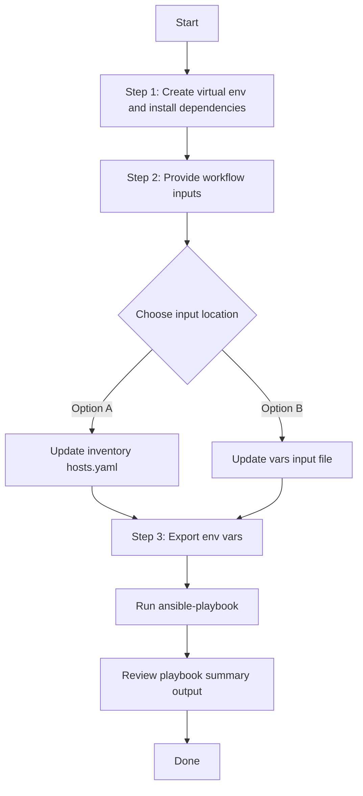

# SDA Host Port Onboarding Config Generator

This workflow runs the `cisco.catalystcenter.sda_host_port_onboarding_playbook_config_generator` module to export host port onboarding configurations from Cisco Catalyst Center into a YAML file that is compatible with `sda_host_port_onboarding_workflow_manager`.

## Files

- `playbook/sda_host_port_onboarding_config_generator.yml`
- `schema/sda_host_port_onboarding_config_schema.yml`
- `vars/sda_host_port_onboarding_config_input.yml`

## Run

> The commands below reference environment variables defined in [Step 0](#step-0-define-reusable-path-variables-one-time-per-shell) of the Installation and Run section.

Run all commands from **your own test project** (not from inside the collection source tree). The playbook supports two input methods:

### Option A: Vars file input (recommended for version-controlled configs)

```bash
ansible-playbook \
  -i "$INVENTORY_PATH" \
  "$PLAYBOOK_PATH" \
  --extra-vars "VARS_FILE_PATH=$VARS_FILE_PATH" \
  -vvvv
```

### Option B: Inventory / host variable input

Omit `VARS_FILE_PATH` and define `sda_host_port_onboarding_config` directly as a host variable in your inventory file or in `host_vars`/`group_vars`.

```bash
ansible-playbook \
  -i "$INVENTORY_PATH" \
  "$PLAYBOOK_PATH" \
  -vvvv
```

The playbook auto-detects the input source and prints it at the start:
- `Input source: vars file <path>` when using Option A
- `Input source: inventory / host variables (VARS_FILE_PATH not provided)` when using Option B

> **Note:** When `VARS_FILE_PATH` is provided, it takes **precedence** over inventory variables.

## Notes

- `state` supports only `gathered`.
- If `generate_all_configurations: true`, all supported onboarding components are exported.
- `file_mode` supports `overwrite` (default) and `append`.
- Uses list-based configuration structure with `sda_host_port_onboarding_config` variable.
- Supports conditional `include_vars` for flexible input methods.

## Workflow Steps
## User Flow (3 Steps)



### Installation and Run

> Run all commands from **your own test project** (not from inside the collection source tree). Instead of hard-coding paths, define a few environment variables once, then copy-paste the commands below without editing.

#### Step 0: Define reusable path variables (one time per shell)

Set these once at the top of your shell session. Every command in this guide will use them, so you don't need to edit any paths later.

```bash
# Root of your test project (change this to your actual project directory)
export PROJECT_DIR="$HOME/my-catc-project"

# Root of the cisco.catalystcenter collection (contains tools/schemavalidation.sh)
export COLLECTION_DIR="$HOME/catalystcenter-ansible"

# Workflow input/config files (all resolved from PROJECT_DIR by default)
export INVENTORY_PATH="$PROJECT_DIR/inventory/hosts.yaml"
export PLAYBOOK_PATH="$PROJECT_DIR/playbook/sda_host_port_onboarding_config_generator.yml"
export VARS_FILE_PATH="$PROJECT_DIR/vars/sda_host_port_onboarding_config_input.yml"
export SCHEMA_FILE_PATH="$PROJECT_DIR/schema/sda_host_port_onboarding_config_schema.yml"
```

> Tip: Save these `export` lines in a file like `env.sh` inside your project, then run `source env.sh` at the start of each session.

#### Step 1: Create a Python virtual environment and install dependencies

```bash
python3 -m venv .venv
source .venv/bin/activate
pip install catalystcentersdk
ansible-galaxy collection install cisco.catalystcenter --force
```

#### Step 2: Provide workflow inputs

Edit either your inventory file (`$INVENTORY_PATH`) or your vars input file (`$VARS_FILE_PATH`) to provide the workflow inputs.

#### Step 3: Export Catalyst Center credentials and run the playbook

```bash
export HOSTIP=<catalyst-center-ip-or-fqdn>
export CATALYST_CENTER_USERNAME=<username>
export CATALYST_CENTER_PASSWORD='<password>'

ansible-playbook \
  -i "$INVENTORY_PATH" \
  "$PLAYBOOK_PATH" \
  -vvvv
```

Or pass the vars input file explicitly via `--extra-vars`:

```bash
ansible-playbook \
  -i "$INVENTORY_PATH" \
  "$PLAYBOOK_PATH" \
  --extra-vars "VARS_FILE_PATH=$VARS_FILE_PATH" \
  -vvvv
```

> The `VARS_FILE_PATH` variable is already an absolute path from Step 0, so no further editing is needed.

## Validate Input (Schema & Vars Validation)

Before running the playbook, validate the input file against the schema using the `schemavalidation.sh` helper (a wrapper around `yamale`). It uses the variables defined in Step 0:

- `-s` : path to the schema file (`$SCHEMA_FILE_PATH`)
- `-v` : path to the vars input file (`$VARS_FILE_PATH`)

```bash
"$COLLECTION_DIR/tools/schemavalidation.sh" \
  -s "$SCHEMA_FILE_PATH" \
  -v "$VARS_FILE_PATH"
```

Expected output:

```bash
(pyats) bash-4.4$ "$COLLECTION_DIR/tools/schemavalidation.sh" \
  -s "$SCHEMA_FILE_PATH" \
  -v "$VARS_FILE_PATH"
$SCHEMA_FILE_PATH
$VARS_FILE_PATH
yamale  -s $SCHEMA_FILE_PATH  $VARS_FILE_PATH
Validating $VARS_FILE_PATH...
Validation success! 👍
```

If `yamale` is not installed in your active environment:

```bash
pip install yamale
```

## VARS_FILE_PATH

Always provide `VARS_FILE_PATH` as an **absolute path**. The simplest way is to define it once in [Step 0](#step-0-define-reusable-path-variables-one-time-per-shell), for example:

```bash
export VARS_FILE_PATH="$PROJECT_DIR/vars/sda_host_port_onboarding_config_input.yml"
```

Then reference it as `"$VARS_FILE_PATH"` in every command — no manual path editing required.

