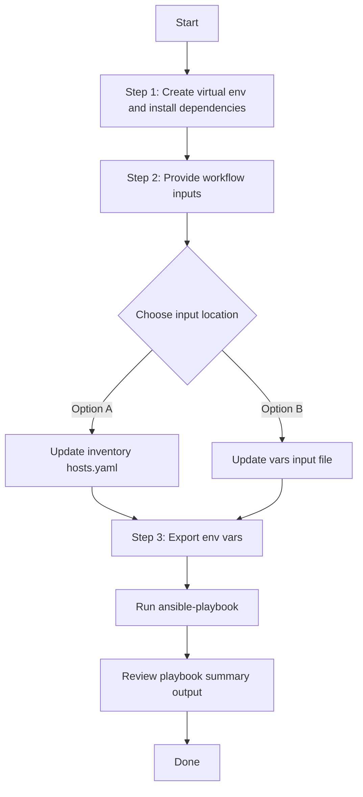

# SDA Host Port Onboarding Config Generator

This workflow runs the `cisco.catalystcenter.sda_host_port_onboarding_playbook_config_generator` module to export host port onboarding configurations from Cisco Catalyst Center into a YAML file that is compatible with `sda_host_port_onboarding_workflow_manager`.

## Files

- `playbook/sda_host_port_onboarding_config_generator.yml`
- `schema/sda_host_port_onboarding_config_schema.yml`
- `vars/sda_host_port_onboarding_config_input.yml`

## Run

Run all commands from **your own test project** (not from inside the collection source tree). Every file path must be an **absolute path** on your machine. The playbook supports two input methods:

### Option A: Vars file input (recommended for version-controlled configs)

```bash
ansible-playbook \
  -i /<abs-path-to-inventory>/hosts.yaml \
  /<abs-path-to-playbook>/sda_host_port_onboarding_config_generator.yml \
  --extra-vars VARS_FILE_PATH=/<abs-path-to-vars>/sda_host_port_onboarding_config_input.yml \
  -vvvv
```

### Option B: Inventory / host variable input

Omit `VARS_FILE_PATH` and define `sda_host_port_onboarding_config` directly as a host variable in your inventory file or in `host_vars`/`group_vars`.

```bash
ansible-playbook \
  -i /<abs-path-to-inventory>/hosts.yaml \
  /<abs-path-to-playbook>/sda_host_port_onboarding_config_generator.yml \
  -vvvv
```

The playbook auto-detects the input source and prints it at the start:
- `Input source: vars file <path>` when using Option A
- `Input source: inventory / host variables (VARS_FILE_PATH not provided)` when using Option B

> **Note:** When `VARS_FILE_PATH` is provided, it takes **precedence** over inventory variables. Always pass `VARS_FILE_PATH` as an **absolute path** — the playbook and the vars file may live in different directories in your project.

## Notes

- `state` supports only `gathered`.
- If `generate_all_configurations: true`, all supported onboarding components are exported.
- `file_mode` supports `overwrite` (default) and `append`.
- Uses list-based configuration structure with `sda_host_port_onboarding_config` variable.
- Supports conditional `include_vars` for flexible input methods.

## Workflow Steps
## User Flow (3 Steps)



### Installation and Run

> Run all commands from **your own test project** (not from inside the collection source tree). Every file path below must be an **absolute path** on your machine. The playbook, inventory, vars, and schema files can live in different directories — always pass each one as a full absolute path.
>
> Placeholders used in the examples below (replace each with the actual absolute path on your system):
>
> - `/<abs-path-to-inventory>/hosts.yaml` — your inventory file
> - `/<abs-path-to-playbook>/sda_host_port_onboarding_config_generator.yml` — the playbook file
> - `/<abs-path-to-vars>/sda_host_port_onboarding_config_input.yml` — your input vars file
> - `/<abs-path-to-schema>/sda_host_port_onboarding_config_schema.yml` — the schema file
> - `/<abs-path-to-collection>/tools/schemavalidation.sh` — schema validation helper

1. Create and activate a Python virtual environment, then install dependencies.

```bash
python3 -m venv /<abs-path-to-your-project>/.venv
source /<abs-path-to-your-project>/.venv/bin/activate
pip install -r /<abs-path-to-your-project>/requirements.txt
ansible-galaxy collection install cisco.catalystcenter --force
```

2. Provide workflow inputs in either your inventory file (`/<abs-path-to-inventory>/hosts.yaml`) or your vars input file (`/<abs-path-to-vars>/sda_host_port_onboarding_config_input.yml`).

3. Export Catalyst Center environment variables and run the playbook.

```bash
export HOSTIP=<catalyst-center-ip-or-fqdn>
export CATALYST_CENTER_USERNAME=<username>
export CATALYST_CENTER_PASSWORD='<password>'

ansible-playbook \
  -i /<abs-path-to-inventory>/hosts.yaml \
  /<abs-path-to-playbook>/sda_host_port_onboarding_config_generator.yml \
  --extra-vars VARS_FILE_PATH=/<abs-path-to-vars>/sda_host_port_onboarding_config_input.yml \
  -vvvv
```

> Always pass `VARS_FILE_PATH` as an **absolute path**. The playbook and the vars file may live in different directories in your project, so relative paths are not supported by this documentation.

## Validate Input (Schema & Vars Validation)

Before running the playbook, validate the input file against the schema using the `schemavalidation.sh` helper (a wrapper around `yamale`). Pass absolute paths for both arguments:

- `-s` : absolute path to the schema file
- `-v` : absolute path to the vars (input) file

```bash
/<abs-path-to-collection>/tools/schemavalidation.sh \
  -s /<abs-path-to-schema>/sda_host_port_onboarding_config_schema.yml \
  -v /<abs-path-to-vars>/sda_host_port_onboarding_config_input.yml
```

Expected output:

```bash
(pyats) bash-4.4$ /<abs-path-to-collection>/tools/schemavalidation.sh \
  -s /<abs-path-to-schema>/sda_host_port_onboarding_config_schema.yml \
  -v /<abs-path-to-vars>/sda_host_port_onboarding_config_input.yml
/<abs-path-to-schema>/sda_host_port_onboarding_config_schema.yml
/<abs-path-to-vars>/sda_host_port_onboarding_config_input.yml
yamale  -s /<abs-path-to-schema>/sda_host_port_onboarding_config_schema.yml  /<abs-path-to-vars>/sda_host_port_onboarding_config_input.yml
Validating /<abs-path-to-vars>/sda_host_port_onboarding_config_input.yml...
Validation success! 👍
```

If `yamale` is not installed in your active environment:

```bash
pip install yamale
```

## VARS_FILE_PATH

Always pass `VARS_FILE_PATH` as an **absolute path**, for example:

```
/<abs-path-to-vars>/sda_host_port_onboarding_config_input.yml
```

Relative paths are intentionally not documented — the playbook and the vars file may live in different directories on a customer's system, so absolute paths are the only supported form.

