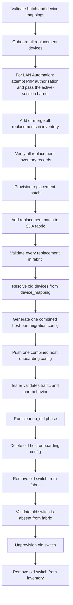

# Switch Refresh Testing Guide

This guide explains how to test the Catalyst Center switch refresh use case with
the Ansible roles and playbooks added for this workflow.

The workflow replaces an old SDA edge switch with a new switch, migrates
host-facing port assignments and port channels, validates fabric membership, and
then cleans up the old switch after manual validation.

## Files Used By This Test

| File | Purpose |
| --- | --- |
| `playbooks/switch_refresh_prepare.yml` | Runs the prepare phase for a replacement batch. |
| `playbooks/switch_refresh_cleanup_old.yml` | Runs the cleanup phase for the old switch after validation. |
| `playbooks/vars/switch_refresh_usecase.yml` | Sample input file for Catalyst Center connection details and switch refresh devices. |
| `roles/switch_refresh/` | Main orchestration role for the end-to-end switch refresh use case. |
| `roles/switch_refresh/tasks/build_batch_plan.yml` | Validates batch input and builds one multi-device payload per prepare stage. |
| `roles/switch_refresh/tasks/prepare_batch.yml` | Runs stage-oriented Discovery or LAN Automation, inventory, provisioning, fabric, and host-onboarding batch calls. |
| `roles/switch_refresh/tasks/wait_for_lan_automation.yml` | Blocks downstream switch-refresh tasks until Catalyst Center reports no active LAN Automation sessions in two consecutive polls. |
| `roles/lan_automation/` | Launches LAN Automation and passes the switch-refresh task timeout and polling interval to the workflow manager. |
| `roles/inventory/` | Adds or merges the replacement batch in Catalyst Center inventory before provisioning. |
| `roles/network_devices_info/` | Resolves old devices and verifies replacement inventory records. |
| `roles/sda_host_port_migration_config_generator/` | Role wrapper around `sda_host_port_migration_playbook_config_generator`. |
| `roles/sda_host_port_onboarding_config_generator/` | Reads the old-device host-port payload used by cleanup deletion. |

## Workflow Summary



The prepare phase is stage-batched and fail-fast. Each workflow role is invoked
once with the complete device set for that stage. This removes the former outer
serialization where one replacement completed the whole prepare pipeline before
the next replacement started. Some workflow managers and Catalyst Center APIs
still process members of a submitted batch sequentially, so this design does not
promise independent per-device continuation after a batch-stage failure.
Devices that should share prepare-stage calls must be grouped in one
`switch_refresh_devices` entry. Separate entries, such as batches for different
fabric sites, are still processed in list order. Cleanup resolves every old
device and rejects duplicate resolved targets before it starts, then processes
old-device cleanup mappings sequentially for cutover safety.

## Prerequisites

Install and configure the test environment before running the playbooks.

1. Ansible is installed on the test machine.
2. The `cisco.catalystcenter` collection is available from this repository.
3. Python dependencies required by the collection are installed.
4. Catalyst Center is reachable from the test machine.
5. Catalyst Center credentials have permissions for discovery, inventory add or
   update, inventory lookup, provisioning, SDA fabric device operations, host
   port onboarding, and fabric-device information lookup.
6. The old switch is still present in Catalyst Center inventory during both
   prepare and cleanup.
7. The old switch is part of the target SDA fabric as an edge device.
8. The old switch has host port assignments and/or port channels that should be
   migrated.
9. The replacement devices are ready for the selected Discovery or LAN Automation
   onboarding method and subsequent provisioning.
10. Device CLI credentials are available for adding the replacement devices with
    the inventory workflow. Store them in Ansible Vault or protected inventory
    variables.
11. If replacement devices use different interface names or port layouts, the
    tester has each source-to-destination interface mapping.
12. LAN Automation testing uses `catalystcentersdk` `3.1.6.0.2` or later,
    Python 3.12 or later, and the collection's `ansible.utils` dependency.

## Test Phases

The use case is intentionally split into two phases.

### Phase 1: Prepare Replacement Switch

Run `playbooks/switch_refresh_prepare.yml`.

This phase performs these actions:

1. Validates the complete replacement-device batch and old-to-new mappings.
2. Onboards all replacement devices with one call to either the existing
   `discovery` role or the existing `lan_automation` role.
3. For LAN Automation, attempts requested PnP authorization before returning
   when the manager task reports completion.
4. For LAN Automation, waits until Catalyst Center reports both
   `activeSessions: 0` and `activeSessionIds: []` in two consecutive polls.
5. Adds or merges all replacement devices in Catalyst Center inventory and sets
   their inventory role to `ACCESS`.
6. Verifies one `ACCESS` inventory record for every expected replacement IP with
   a shared `network_devices_info` query.
7. Provisions all replacement devices with one `provision` role call.
8. Adds all replacement devices to the fabric as edge devices with one
   `sda_fabric_devices` role call.
9. Validates every replacement device with one `fabric_devices_info` role call.
10. Resolves old-switch details from `device_mapping`, then generates one
    combined host-port onboarding config.
11. Pushes the combined config with one `sda_host_port_onboarding` role call.

### Phase 2: Cleanup Old Switch

Run `playbooks/switch_refresh_cleanup_old.yml` only after the tester validates
the replacement switch and confirms that old-switch cleanup can proceed.

This phase performs these actions:

1. Resolves every old switch with one `network_devices_info` preflight and
   rejects missing, ambiguous, or duplicate resolved devices.
2. Generates a delete payload for the old switch host onboarding config.
3. Deletes old switch host onboarding config with `sda_host_port_onboarding`.
4. Removes the old switch from fabric with `sda_fabric_devices`.
5. Validates that the old switch is absent from fabric with
   `fabric_devices_info`.
6. Unprovisions the old switch with `provision`.
7. Removes the old switch from Catalyst Center inventory.

## Minimal Input Required From Tester

Edit `playbooks/vars/switch_refresh_usecase.yml`.

For a batch prepare run, provide:

1. Catalyst Center connection variables.
2. Device CLI credentials for the inventory workflow, supplied globally, for
   the batch, or through a complete inventory payload.
3. Fabric site hierarchy.
4. Replacement switch IPs under `new_devices.device_ips`.
5. Replacement onboarding method: `discovery` or `lan_automation`.
6. For LAN Automation, one shared `new_devices.lan_automation_config`.
7. When host onboarding is enabled, one old-to-new `device_mapping` entry for
   every new IP.
8. Interface mappings only when old and new switch ports are different.

Minimal example:

```yaml
catalystcenter_host: "198.51.100.10"
catalystcenter_port: 443
catalystcenter_username: "admin"
catalystcenter_password: "password"
catalystcenter_version: "2.3.7.9"
catalystcenter_verify: false

switch_refresh_work_dir: /tmp/catalystcenter_switch_refresh
switch_refresh_onboarding_method: discovery
switch_refresh_inventory_credentials:
  username: "{{ vault_switch_cli_username }}"
  password: "{{ vault_switch_cli_password }}"
  enable_password: "{{ vault_switch_enable_password }}"
  cli_transport: ssh
  type: NETWORK_DEVICE
switch_refresh_device_info_lookup_enabled: true
switch_refresh_fabric_validation_enabled: true
switch_refresh_lan_automation_completion_timeout: 604800
switch_refresh_lan_automation_completion_poll_interval: 30

switch_refresh_devices:
  - name: sjc-edge-refresh-batch
    fabric_site_name_hierarchy: Global/USA/SAN-JOSE/BLDG23
    onboarding_method: discovery
    new_devices:
      device_ips:
        - 10.10.10.20
        - 10.10.10.21
    device_mapping:
      - old_device_hostname: SJ-EDGE-OLD-01.cisco.local
        new_device_management_ip: 10.10.10.20
        interface_mappings: []
      - old_device_hostname: SJ-EDGE-OLD-02.cisco.local
        new_device_management_ip: 10.10.10.21
        interface_mappings: []
```

When `switch_refresh_host_onboarding_enabled=false`, `device_mapping` may be
omitted and Discovery onboarding can use only `new_devices.device_ips` plus the
global site and inventory defaults during `prepare`. The `cleanup_old` phase
always requires a non-empty `device_mapping` whose destination IPs exactly
cover `new_devices.device_ips`.

The old switch can be identified by any one of these fields:

```yaml
old:
  management_ip: 10.10.10.10
```

```yaml
old:
  hostname: SJ-EDGE-OLD.cisco.local
```

```yaml
old:
  serial_number: FOC1234ABCD
```

```yaml
old:
  mac_address: 00:11:22:33:44:55
```

## Interface Mapping

Use `interface_mappings` when the new switch has different interface names or a
different physical port layout.

Example:

```yaml
interface_mappings:
  - source_interface_name: GigabitEthernet1/0/1
    destination_interface_name: TenGigabitEthernet1/0/1
  - source_interface_name: GigabitEthernet1/0/2
    destination_interface_name: TenGigabitEthernet1/0/2
  - source_interface_name: GigabitEthernet1/0/47
    destination_interface_name: TenGigabitEthernet1/1/1
  - source_interface_name: GigabitEthernet1/0/48
    destination_interface_name: TenGigabitEthernet1/1/2
```

If port assignment mappings and port channel member mappings are different, use
separate mapping lists:

```yaml
port_assignment_interface_mappings:
  - source_interface_name: GigabitEthernet1/0/10
    destination_interface_name: GigabitEthernet1/0/20

port_channel_interface_mappings:
  - source_interface_name: GigabitEthernet1/0/47
    destination_interface_name: TenGigabitEthernet1/1/1
```

If old and new interface names are the same, keep mappings empty:

```yaml
interface_mappings: []
```

## Replacement Switch Onboarding Options

The prepare playbook gives the tester two onboarding choices for the replacement
batch.

| Method | Use When | Required New-Switch Input |
| --- | --- | --- |
| `discovery` | Replacement devices already have reachable management IPs and should be discovered normally. | `new_devices.device_ips`; optionally a complete flat `new_devices.discovery_config` list |
| `lan_automation` | Replacement devices should be onboarded through Catalyst Center LAN Automation. | `new_devices.device_ips` and one launch-only `new_devices.lan_automation_config` entry |

Both methods also require `switch_refresh_inventory_credentials`, batch-level
`new_devices.inventory_credentials`, or a complete
`new_devices.inventory_config` before the provisioning stage can run.

Set a global default:

```yaml
switch_refresh_onboarding_method: discovery
```

Override it per batch:

```yaml
switch_refresh_devices:
  - name: sjc-edge-refresh
    onboarding_method: discovery
```

```yaml
switch_refresh_devices:
  - name: sjc-edge-refresh-lan-auto
    onboarding_method: lan_automation
```

### Option 1: Discovery

By default, the role builds a flat discovery workflow list from
`new_devices.device_ips` and uses Catalyst Center global credentials. One IP
uses `SINGLE`; multiple arbitrary IPs use `MULTI RANGE`. A manager entry accepts
at most eight ranges, so a larger batch is divided into uniquely named chunks
inside the same Discovery role call.

Minimal discovery input:

```yaml
new_devices:
  device_ips:
    - 10.10.10.20
    - 10.10.10.21
```

Use a full flat `new_devices.discovery_config` only when the tester needs custom
credentials or target-only Discovery settings. It completely replaces the
generated payload, and the explicit IPs must exactly match `device_ips`:

```yaml
new_devices:
  device_ips:
    - 10.10.10.20
    - 10.10.10.21
  discovery_config:
    - discovery_name: switch-refresh-sjc-edge
      discovery_type: MULTI RANGE
      ip_address_list:
        - 10.10.10.20
        - 10.10.10.21
      protocol_order: ssh
      retry: 2
      discovery_specific_credentials:
        cli_credentials_list:
          - username: "switch-admin"
            password: "switch-password"
            enable_password: "enable-password"
```

Batch custom Discovery accepts `SINGLE`, target-only `RANGE`, and
`MULTI RANGE` entries with explicit IPs. Broad CDP, LLDP, CIDR, and multi-device
ranges are rejected because they can discover switches outside the
authoritative replacement set.

### Option 2: LAN Automation

Use LAN Automation when replacement devices should be brought in through one
LAN Automation session instead of normal Discovery. This path uses the existing
`lan_automation` role. One launch supports up to 50 `discovery_devices`; it does
not add only five devices.

The tester must provide seed or peer device details, seed interfaces, IP pools,
discovery settings, and the target discovered-device details expected by
Catalyst Center. Every discovered device needs a serial number and management
IP, and the management-IP set must exactly match `new_devices.device_ips`.

The switch-refresh LAN Automation payload is deliberately launch-only. It must
meet all of these requirements:

1. `switch_refresh_lan_automation_enabled` is `true`.
2. `new_devices.lan_automation_state` is omitted or set to `merged`.
3. `new_devices.lan_automation_config` contains exactly one list entry.
4. The only key in that entry is `lan_automation`.
5. `launch_and_wait` is explicitly set to the boolean `true`.
6. Every `discovery_devices` entry includes a serial number; when
   `pnp_authorization: true`, the requested serials are available for
   authorization.

Do not place `lan_automated_device_update` or `port_channel` beside the launch
configuration. The workflow manager would process those operations inside the
same call, before the external completion barrier. Run them in a later workflow
after switch-refresh preparation has passed the barrier.

Configure the manager and role-level waiting with:

```yaml
switch_refresh_lan_automation_completion_timeout: 604800
switch_refresh_lan_automation_completion_poll_interval: 30
```

Both values are measured in seconds. `discovery_timeout` inside the LAN
Automation payload remains a Catalyst Center server-side timeout measured in
minutes.

With PnP authorization enabled, the manager attempts authorization before it
accepts task progress containing `complete`. A completed manager task is not
kept in a polling loop solely because its internal PnP authorization list has
not cleared. After the manager returns, the switch-refresh role independently
waits for two consecutive active-session responses containing:

```yaml
activeSessions: 0
activeSessionIds: []
```

This is a controller-wide safety barrier. An unrelated LAN Automation session
on the same Catalyst Center also blocks inventory and provisioning until that
session finishes. A switch-refresh session that is still waiting for PnP
authorization also keeps this barrier closed, so downstream workflows cannot
start early.

Example:

```yaml
switch_refresh_devices:
  - name: sjc-edge-03-refresh-lan-auto
    fabric_site_name_hierarchy: Global/USA/SAN-JOSE/BLDG23
    onboarding_method: lan_automation
    new_devices:
      device_ips:
        - 204.1.1.13
        - 204.1.1.14
      lan_automation_config:
        - lan_automation:
            discovered_device_site_name_hierarchy: Global/USA/SAN JOSE
            peer_device_management_ip_address: 91.1.1.2
            primary_device_management_ip_address: 204.1.1.4
            primary_device_interface_names:
              - HundredGigE1/0/2
            ip_pools:
              - ip_pool_name: underlay_sub
                ip_pool_role: MAIN_POOL
              - ip_pool_name: underlay_sub_small
                ip_pool_role: PHYSICAL_LINK_POOL
            multicast_enabled: true
            redistribute_isis_to_bgp: true
            host_name_prefix: San-Jose
            isis_domain_pwd: cisco
            discovery_level: 5
            discovery_timeout: 40
            discovery_devices:
              - device_serial_number: FXS2429Q0WE
                device_host_name: SR-LAN-9400X-EDGE1
                device_site_name_hierarchy: Global/USA/SAN JOSE/BLD20/BLD20_FLOOR1
                device_management_ip_address: 204.1.1.13
              - device_serial_number: FXS2429Q0WF
                device_host_name: SR-LAN-9400X-EDGE2
                device_site_name_hierarchy: Global/USA/SAN JOSE/BLD20/BLD20_FLOOR1
                device_management_ip_address: 204.1.1.14
            launch_and_wait: true
            pnp_authorization: true
    device_mapping:
      - old_device_hostname: SJ-EDGE-OLD-03.cisco.local
        new_device_management_ip: 204.1.1.13
        interface_mappings: []
      - old_device_hostname: SJ-EDGE-OLD-04.cisco.local
        new_device_management_ip: 204.1.1.14
        interface_mappings: []
```

For LAN Automation, keep `new_devices.device_ips` aligned with the management
IPs the devices will have after LAN Automation. The switch refresh role uses
that authoritative set for inventory lookup, provisioning, fabric add, and
host-port migration.

The following payload is intentionally invalid for switch refresh because it
contains an operation that could run before the completion barrier:

```yaml
lan_automation_config:
  - lan_automation:
      primary_device_management_ip_address: 204.1.1.4
      launch_and_wait: true
    lan_automated_device_update:
      # Not allowed in the switch-refresh launch call.
```

### LAN Automation Completion-Gate Test Cases

Run these cases before approving the change for production use.

#### Happy Path With PnP Authorization

1. Use a valid launch-only payload with `launch_and_wait: true` and
   `pnp_authorization: true`.
2. Confirm the target serial reaches PnP Pending Authorization.
3. Confirm the workflow manager authorizes it before reporting LAN Automation
   task completion.
4. While Catalyst Center reports an active LAN Automation session, confirm that
   no inventory or `Manage Device Provisioning` task starts.
5. Confirm the role observes zero active sessions twice, separated by
   `switch_refresh_lan_automation_completion_poll_interval`.
6. Confirm inventory and provisioning start only after the second observation.

#### Active Session Still Running

1. Start LAN Automation with a discovery period long enough to observe polling.
2. Confirm `Confirm LAN Automation remains inactive` retries while
   `activeSessions` is nonzero or `activeSessionIds` is nonempty.
3. Confirm provisioning is absent from the Ansible task output during this
   period.

#### Unrelated Active Session

1. Run an unrelated LAN Automation session on the same Catalyst Center.
2. Start the switch-refresh prepare playbook.
3. Confirm the global barrier waits for the unrelated session as well.
4. Stop or complete the unrelated session and confirm switch refresh proceeds
   only after two empty active-session responses.

#### Invalid Input And Timeout Cases

Verify that preparation fails before provisioning for each case:

- `switch_refresh_lan_automation_enabled: false` with LAN Automation onboarding.
- `launch_and_wait: false` or the string `"true"` instead of boolean `true`.
- More than one `lan_automation_config` entry.
- More than 50 `discovery_devices` in one LAN Automation launch.
- A sibling `lan_automated_device_update` or `port_channel` key.
- `pnp_authorization: true` without a serial number.
- A PnP device that never becomes eligible for authorization while the LAN
  Automation session remains active.
- An active LAN Automation session that does not finish before the configured
  timeout.

## Inventory Before Provisioning

The replacement batch is added or merged into Catalyst Center inventory after
Discovery, or after the LAN Automation manager and two-pass active-session
barrier have completed. Inventory finishes before provisioning.

The role chooses inventory input in this order:

1. Use `new_devices.inventory_config` when a complete inventory workflow payload is
   supplied.
2. Otherwise, combine all `new_devices.device_ips` with batch-level
   `new_devices.inventory_credentials`.
3. If no batch credentials are supplied, combine all `device_ips` with the
   global `switch_refresh_inventory_credentials` value.

The default generated payload is equivalent to:

```yaml
inventory_config:
  - ip_address_list:
      - 10.10.10.20
      - 10.10.10.21
    username: "{{ vault_switch_cli_username }}"
    password: "{{ vault_switch_cli_password }}"
    enable_password: "{{ vault_switch_enable_password }}"
    cli_transport: ssh
    type: NETWORK_DEVICE
```

The role passes this payload to the existing `inventory` role with
`inventory_state: merged`, sets all target roles to `ACCESS`, and then makes one
`network_devices_info` query. The result must contain exactly one `ACCESS`
record for every expected management IP before the `provision` role is called.

Catalyst Center global Discovery credentials cannot be read back by Ansible for
the inventory workflow. Even when Discovery uses
`use_global_credentials: true`, inventory credentials must be supplied through
Ansible variables or a complete inventory payload.

Use a batch credential override when the replacement devices share credentials
that differ from the global defaults:

```yaml
new_devices:
  device_ips:
    - 10.10.10.20
    - 10.10.10.21
  inventory_credentials:
    username: "{{ vault_special_switch_username }}"
    password: "{{ vault_special_switch_password }}"
    enable_password: "{{ vault_special_switch_enable_password }}"
    cli_transport: ssh
    type: NETWORK_DEVICE
```

Use a complete payload when additional SNMP, NETCONF, HTTP, role, or other
inventory fields are required:

```yaml
new_devices:
  device_ips:
    - 10.10.10.20
    - 10.10.10.21
  inventory_config:
    - ip_address_list:
        - 10.10.10.20
        - 10.10.10.21
      username: "{{ vault_switch_cli_username }}"
      password: "{{ vault_switch_cli_password }}"
      enable_password: "{{ vault_switch_enable_password }}"
      cli_transport: ssh
      netconf_port: "830"
      type: NETWORK_DEVICE
```

## Provisioning And Fabric Input Options

By default, the role builds the provision payload from:

1. `fabric_site_name_hierarchy`
2. Every IP in `new_devices.device_ips`

The default provision payload is equivalent to:

```yaml
new_devices:
  provision_config:
    - site_name_hierarchy: Global/USA/SAN-JOSE/BLDG23
      management_ip_address: 10.10.10.20
    - site_name_hierarchy: Global/USA/SAN-JOSE/BLDG23
      management_ip_address: 10.10.10.21
```

If the provisioning site is different from the fabric site, set
`provision_site_name_hierarchy`:

```yaml
provision_site_name_hierarchy: Global/USA/SAN-JOSE/BLDG23/FLOOR1
```

By default, the role adds every replacement device to fabric as `EDGE_NODE`.

The default fabric device payload is equivalent to:

```yaml
new_devices:
  fabric_devices_config:
    - fabric_devices:
        fabric_name: Global/USA/SAN-JOSE/BLDG23
        device_config:
          - device_ip: 10.10.10.20
            device_roles:
              - EDGE_NODE
          - device_ip: 10.10.10.21
            device_roles:
              - EDGE_NODE
```

Custom inventory, provision, and fabric configurations are complete
replacements, not deep merges. Their combined target IPs must exactly match
`new_devices.device_ips`, and a custom fabric configuration must use the batch
`fabric_site_name_hierarchy` as `fabric_name`.

## Recommended Test Run Sequence

Run commands from the collection root:

```bash
cd <collection-root>
```

Confirm Ansible can parse the playbooks:

```bash
ansible-playbook --syntax-check playbooks/switch_refresh_prepare.yml
ansible-playbook --syntax-check playbooks/switch_refresh_cleanup_old.yml
```

Run the prepare phase:

```bash
ansible-playbook playbooks/switch_refresh_prepare.yml
```

After prepare completes, validate in Catalyst Center:

1. Replacement switch completed Discovery or LAN Automation.
2. For LAN Automation, requested PnP authorization completed and Catalyst Center
   reports no active LAN Automation sessions.
3. Replacement switch exists exactly once in Catalyst Center inventory with the
   expected management IP.
4. Replacement switch is provisioned to the expected site.
5. Replacement switch is part of the expected SDA fabric.
6. Replacement switch has the expected edge role.
7. Host port assignments were created on expected replacement interfaces.
8. Port channels were created on expected replacement interfaces.
9. Endpoints or test hosts connected to the replacement switch behave as
   expected.

When validation is complete, run cleanup:

```bash
ansible-playbook playbooks/switch_refresh_cleanup_old.yml
```

After cleanup completes, validate in Catalyst Center:

1. Old switch host onboarding config is removed.
2. Old switch is no longer part of the SDA fabric.
3. Old switch is unprovisioned.
4. Old switch is absent from Catalyst Center inventory.
5. Replacement switch remains in fabric.
6. Replacement switch host onboarding config remains present.

## Running Only Selected Stages

Use stage toggles when the tester needs to isolate a specific part of the
workflow.

Example for discovery-based entries: generate and push host onboarding only
after onboarding, inventory, provisioning, and fabric add were already
completed:

```bash
ansible-playbook playbooks/switch_refresh_prepare.yml \
  -e switch_refresh_onboarding_method=discovery \
  -e switch_refresh_discovery_enabled=false \
  -e switch_refresh_inventory_enabled=false \
  -e switch_refresh_inventory_role_update_enabled=false \
  -e switch_refresh_provision_enabled=false \
  -e switch_refresh_fabric_add_enabled=false
```

Do not set `switch_refresh_lan_automation_enabled=false` for an entry whose
`onboarding_method` is `lan_automation`. The role rejects that combination so a
disabled launch cannot bypass the completion barrier. To resume only later
stages after a completed LAN Automation run, use a separate later-stage
playbook rather than bypassing the switch-refresh gate.

Example: run old-switch fabric removal and unprovisioning only after host
onboarding cleanup was already completed:

```bash
ansible-playbook playbooks/switch_refresh_cleanup_old.yml \
  -e switch_refresh_cleanup_host_onboarding_enabled=false \
  -e switch_refresh_cleanup_inventory_enabled=false
```

Available prepare toggles:

| Variable | Default | Effect |
| --- | --- | --- |
| `switch_refresh_discovery_enabled` | `true` | Discover the replacement batch. |
| `switch_refresh_lan_automation_enabled` | `true` | Run LAN Automation when `onboarding_method` is `lan_automation`; it must remain `true` for that onboarding method. |
| `switch_refresh_inventory_enabled` | `true` | Add or merge the replacement batch in Catalyst Center inventory before provisioning. |
| `switch_refresh_inventory_role_update_enabled` | `true` | Set every replacement inventory role to `ACCESS` in the shared inventory call. |
| `switch_refresh_provision_enabled` | `true` | Provision the replacement batch. |
| `switch_refresh_fabric_add_enabled` | `true` | Add the replacement batch to fabric. |
| `switch_refresh_fabric_validation_enabled` | `true` | Validate fabric membership or absence. |
| `switch_refresh_host_onboarding_enabled` | `true` | Generate and push replacement host onboarding config. |

Available cleanup toggles:

| Variable | Default | Effect |
| --- | --- | --- |
| `switch_refresh_cleanup_host_onboarding_enabled` | `true` | Delete old switch host onboarding config. |
| `switch_refresh_cleanup_fabric_enabled` | `true` | Remove old switch from fabric. |
| `switch_refresh_cleanup_unprovision_enabled` | `true` | Unprovision old switch. |
| `switch_refresh_cleanup_inventory_enabled` | `true` | Remove old switch from Catalyst Center inventory. |
| `switch_refresh_fabric_validation_enabled` | `true` | Validate fabric membership or absence. |

## Generated Files

The role writes generated migration payloads to `switch_refresh_work_dir`.

Default:

```yaml
switch_refresh_work_dir: /tmp/catalystcenter_switch_refresh
```

Prepare phase output file pattern:

```text
/tmp/catalystcenter_switch_refresh/<refresh-name>_host_port_migration.yml
```

Cleanup phase output file pattern:

```text
/tmp/catalystcenter_switch_refresh/<refresh-name>_old_host_port_cleanup.yml
```

For batch input, cleanup creates one file per mapping:

```text
/tmp/catalystcenter_switch_refresh/<batch-name>-<new-IP>_old_host_port_cleanup.yml
```

These generated files are useful for troubleshooting. They show the exact
`sda_host_port_onboarding` config payload that was generated from the old switch
state.

## Expected Results

Prepare is successful when:

1. The playbook completes without failed tasks.
2. For LAN Automation onboarding, requested PnP authorization succeeds and the
   two consecutive no-active-session checks pass before inventory begins.
3. The inventory role successfully adds, merges, or confirms every replacement
   device.
4. `network_devices_info` finds exactly one `ACCESS` record for every expected IP.
5. Every replacement device is provisioned.
6. `fabric_devices_info` validation passes for every replacement device.
7. The generated migration file contains a `config` list.
8. The combined host-port onboarding merge succeeds for the replacement batch.

Cleanup is successful when:

1. The playbook completes without failed tasks.
2. Old switch host onboarding delete succeeds.
3. Old switch fabric removal succeeds.
4. `fabric_devices_info` validation confirms the old switch is absent from
   fabric.
5. Old switch unprovision succeeds.
6. Old switch inventory removal succeeds.

## Important Notes

1. Cleanup is intentionally separate from prepare. Do not run cleanup until the
   replacement switch has been validated.
2. The role migrates port assignments and port channels only.
3. The role does not currently migrate wireless SSID mappings.
4. The replacement switch can eventually take over the old switch identity, but
   the playbooks operate on the current management IPs during the refresh.
5. Keep the old switch in Catalyst Center inventory until cleanup completes.
6. Discovery global credentials are separate from inventory workflow
   credentials. Supply inventory credentials through protected Ansible
   variables.
7. If no host-port payload is generated, the role fails by default. Set
   `switch_refresh_allow_empty_host_port_config=true` only when an empty payload
   is expected for a negative test. The role then skips the host-onboarding call;
   it still rejects a non-empty payload that covers only part of the batch.
8. The LAN Automation completion gate is controller-wide. Any active LAN
   Automation session delays inventory, provisioning, and fabric operations.
9. `discovery_timeout` is measured in minutes. The switch-refresh completion
   timeout and polling interval are measured in seconds.

## Troubleshooting

### Old Switch Lookup Fails

Check that every old-switch identifier under `device_mapping` matches exactly
one device in Catalyst Center inventory. Use either a nested `old` mapping or
one `old_device_*` alias per mapping entry.

Use one of:

```yaml
old:
  management_ip: 10.10.10.10
```

```yaml
old:
  hostname: SJ-EDGE-OLD.cisco.local
```

```yaml
old:
  serial_number: FOC1234ABCD
```

### Replacement Switch Discovery Fails

Check:

1. Every IP in `new_devices.device_ips` is reachable from Catalyst Center.
2. Global credentials in Catalyst Center can log in to every device.
3. If global credentials do not work, use
   `new_devices.discovery_config` with specific
   credentials.
4. The custom discovery config targets the intended replacement devices.

### LAN Automation Input Validation Fails

Check that:

1. `switch_refresh_lan_automation_enabled` is `true`.
2. `new_devices.lan_automation_state` is `merged` or omitted.
3. `new_devices.lan_automation_config` is a list containing exactly one mapping.
4. The mapping's only key is `lan_automation`.
5. `launch_and_wait: true` is a YAML boolean, not a quoted string.
6. Device updates and port-channel operations are not included in the launch
   payload.
7. `discovery_devices` contains at most 50 entries and its management-IP set
   exactly matches `new_devices.device_ips`.

### PnP Authorization Does Not Complete

When `pnp_authorization: true`, verify that:

1. Every target device has a serial number in `discovery_devices` or
   `device_serial_number_authorization`.
2. The serial number matches the PnP record exactly.
3. The device reaches Pending Authorization before the configured timeout.
4. The Catalyst Center account can authorize PnP devices.
5. Catalyst Center does not show the device in an error state.

The manager attempts PnP authorization before accepting completed task
progress, but it does not keep a completed start task in an internal PnP polling
loop. If authorization is still required, the controller continues reporting an
active LAN Automation session and the role-level completion barrier keeps
inventory and provisioning blocked. Increase the timeout only when the active
session legitimately needs more time:

```yaml
switch_refresh_lan_automation_completion_timeout: 7200
switch_refresh_lan_automation_completion_poll_interval: 30
```

### LAN Automation Completion Barrier Keeps Retrying

The `Confirm LAN Automation remains inactive` task requires both
`activeSessions: 0` and `activeSessionIds: []`. Check the Catalyst Center LAN
Automation page for:

1. The switch-refresh session still running.
2. An unrelated session running for another seed or site.
3. A session waiting for PnP authorization.
4. A session waiting for its discovery timeout or manual stop.

The barrier is intentionally controller-wide. Do not bypass it by disabling
LAN Automation. Resolve or stop the active session, then allow the task to
observe two consecutive empty responses.

### Provisioning Reports `Device in LAN Automation`

With this completion gate, `Manage Device Provisioning` must appear only after
both quiescence checks have passed. If the error still occurs:

1. Confirm the run used the updated `switch_refresh` role and
   `wait_for_lan_automation.yml`.
2. Confirm the output shows both `initial quiescence` and
   `confirmation quiescence` succeeding before inventory and provisioning.
3. Confirm no new LAN Automation session started between the barrier and
   provisioning.
4. Collect the active-session API response and the relevant Catalyst Center
   task IDs for further diagnosis.

### Replacement Switch Inventory Add Fails

Check:

1. `switch_refresh_inventory_credentials` contains `username` and `password`,
   or `new_devices.inventory_config` contains all required inventory fields.
2. Device CLI credentials are correct and have sufficient privilege.
3. `cli_transport` matches the replacement switch configuration.
4. The management IP is reachable from Catalyst Center.
5. Additional SNMP or NETCONF fields required by the environment are included
   in `new_devices.inventory_config` or
   `new_devices.inventory_credentials`.

Do not assume `use_global_credentials: true` in the Discovery payload supplies
credentials to the inventory workflow. Catalyst Center does not expose those
credential secrets back to this Ansible role.

### Replacement Switch Is Not Found After Inventory Add

The role uses `network_devices_info` after the inventory role and before
provisioning. Confirm the inventory task completed successfully. If the device
is present but lookup is delayed, increase lookup retry settings:

```yaml
switch_refresh_device_info_lookup_timeout: 180
switch_refresh_device_info_lookup_retries: 12
switch_refresh_device_info_lookup_interval: 15
```

### Fabric Validation Fails After Add

Check:

1. `fabric_site_name_hierarchy` is the SDA fabric site hierarchy.
2. Replacement switch provisioning completed successfully.
3. Replacement switch is eligible to be added as an SDA edge node.
4. The expected role is `EDGE_NODE`, or set a custom validation role:

```yaml
fabric_validation_role: EDGE_NODE
```

You can increase validation retry settings:

```yaml
switch_refresh_fabric_validation_timeout: 180
switch_refresh_fabric_validation_retries: 12
switch_refresh_fabric_validation_interval: 15
```

### Generated Host-Port Config Is Empty

Check:

1. The old switch has SDA host port assignments or port channels.
2. The old switch is in the fabric site specified by
   `fabric_site_name_hierarchy`.
3. Interface mappings use exact source interface names from the old switch.
4. The old switch management IP resolves correctly.

### Cleanup Fails Because Old Switch Is Still In Fabric

Check:

1. Host onboarding delete completed successfully.
2. Fabric device delete completed successfully.
3. Catalyst Center has finished processing the fabric removal task.
4. Increase `switch_refresh_fabric_validation_retries` and rerun cleanup if the
   fabric removal is eventually consistent.

## Sample Multi-Switch Batch Test

One batch entry can refresh multiple switches through one call per workflow
stage.

```yaml
switch_refresh_inventory_credentials:
  username: "{{ vault_switch_cli_username }}"
  password: "{{ vault_switch_cli_password }}"
  enable_password: "{{ vault_switch_enable_password }}"
  cli_transport: ssh
  type: NETWORK_DEVICE

switch_refresh_devices:
  - name: sjc-edge-refresh-batch
    fabric_site_name_hierarchy: Global/USA/SAN-JOSE/BLDG23
    onboarding_method: discovery
    new_devices:
      device_ips:
        - 10.10.10.20
        - 10.10.10.21
    device_mapping:
      - old_device_hostname: SJ-EDGE-OLD-01.cisco.local
        new_device_management_ip: 10.10.10.20
        interface_mappings:
          - source_interface_name: GigabitEthernet1/0/1
            destination_interface_name: TenGigabitEthernet1/0/1
      - old_device_serial_number: FOC1234ABCD
        new_device_management_ip: 10.10.10.21
        interface_mappings: []
```

For the first test cycle, validate one batch with two devices. Confirm that each
workflow role appears once in Ansible output, receives both target IPs, and that
old-device lookup starts only after all replacement devices pass fabric
validation. LAN Automation still uses a controller-wide completion barrier and
therefore waits for unrelated active sessions.
