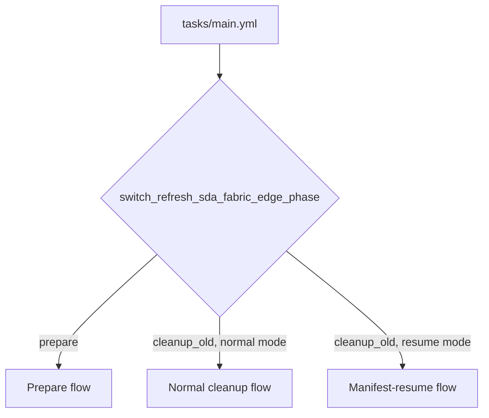

# switch_refresh_sda_fabric_edge — Code Walkthrough & Flow Guide

This document is a code-reviewer's map of the role: what each file does, which
flow(s) call it, and in what order. Pair it with [README.md](README.md) (variable
reference) and the complete
[playbook variables example](../../playbooks/vars/switch_refresh_sda_fabric_edge_usecase.yml)
— this file focuses on **control flow through the code**, not on how to
configure or run the role.

## Role at a glance

- **Entry point:** [tasks/main.yml](tasks/main.yml) — the only file Ansible
  invokes directly. Everything else is reached through `include_tasks` or
  `include_role`.
- **Control variable:** `switch_refresh_sda_fabric_edge_phase` selects one of
  three flows: `prepare`, normal `cleanup_old`, or manifest-resume
  `cleanup_old` (a sub-mode of `cleanup_old` selected by
  `switch_refresh_sda_fabric_edge_hostname_transfer_resume_from_manifest`).
- **Batching model:** every flow operates on `switch_refresh_sda_fabric_edge_batches`,
  a list of batches. Each batch is validated and planned *before* any batch
  starts mutating Catalyst Center, and each batch's own stages run in the order
  shown below.
- **Two playbooks front the role:**
  [playbooks/switch_refresh_sda_fabric_edge_prepare.yml](../../playbooks/switch_refresh_sda_fabric_edge_prepare.yml)
  and
  [playbooks/switch_refresh_sda_fabric_edge_cleanup_old.yml](../../playbooks/switch_refresh_sda_fabric_edge_cleanup_old.yml).



---

## Flow 1 — Prepare (`switch_refresh_sda_fabric_edge_phase: prepare`)

Onboards every replacement switch in every batch and migrates host-port
configuration onto them. Non-destructive to old switches.

### Call chain

```
tasks/main.yml
└─ preflight_prepare_batch.yml        (loop: once per batch, read-only)
   ├─ build_batch_plan.yml
   │  ├─ build_golden_image_plan.yml     (when golden_image is present)
   │  └─ normalize_batch_mapping.yml       (loop: once per device_mapping entry)
   ├─ resolve_batch_old_devices.yml
   │  └─ resolve_batch_mapping.yml         (loop: once per mapping)
   ├─ validate_fabric_membership.yml
   │  └─ validate_fabric_membership_result.yml
   └─ preflight_output_path.yml
└─ prepare_batch.yml                   (loop: once per batch, mutating)
   ├─ discovery role                    (only onboarding_method: discovery)
   ├─ swim role                         (optional; before LAN Automation)
   ├─ lan_automation role               (only onboarding_method: lan_automation)
   ├─ wait_for_lan_automation.yml           (only onboarding_method: lan_automation)
   ├─ validate_fabric_membership.yml (→ validate_fabric_membership_result.yml)
   ├─ revalidate_batch_old_devices.yml
   │  └─ resolve_batch_old_devices.yml (→ resolve_batch_mapping.yml)
   └─ prepare_batch_host_onboarding.yml
```

### File purposes

| File | Purpose in the prepare flow |
|---|---|
| [tasks/main.yml](tasks/main.yml) | Validates control variables (`switch_refresh_sda_fabric_edge_phase`, `switch_refresh_sda_fabric_edge_cleanup_old`, SWIM and hostname-transfer flags), validates every batch's top-level shape, enforces cross-batch uniqueness (including golden-image claim conflicts), then loops batches through preflight and then through execution. |
| [tasks/preflight_prepare_batch.yml](tasks/preflight_prepare_batch.yml) | Read-only per-batch planner. Builds the batch plan, resolves old devices (if host onboarding is enabled), proves old devices are `EDGE_NODE` in the fabric, preflights the migration output file path, and stores the normalized SWIM configuration and other fields in an immutable plan object for execution. |
| [tasks/build_batch_plan.yml](tasks/build_batch_plan.yml) | The biggest validator. Parses `new_devices`/`device_mapping`, validates replacement IP syntax and onboarding method, normalizes an optional constrained `golden_image` declaration, generates (or validates custom) Discovery/LAN Automation/Inventory/Provision/Fabric-device configs, and computes the migration output file path. The golden-image plan derives the batch site and forces role `ALL` plus `tagging: true`. |
| [tasks/build_golden_image_plan.yml](tasks/build_golden_image_plan.yml) | Pure golden-image planner. Rejects caller-controlled site/role/tagging and unrelated SWIM actions, validates an optional single-image remote/CCO import, normalizes scalar CCO input to a one-item list, constructs the direct `swim_config` entry, and creates the site/family/`ALL` cross-batch claim used to reject conflicting requested images. |
| [tasks/normalize_batch_mapping.yml](tasks/normalize_batch_mapping.yml) | Per-mapping helper. Validates one `device_mapping` entry's `old` identifier (exactly one of `management_ip`/`hostname`/`serial_number`/`mac_address`) and its interface-mapping lists, then normalizes and appends it. |
| [tasks/resolve_batch_old_devices.yml](tasks/resolve_batch_old_devices.yml) | Looks up every old device in live inventory (via the `network_devices_info` role) and hands each mapping off to `resolve_batch_mapping.yml` to pin down its management IP. |
| [tasks/resolve_batch_mapping.yml](tasks/resolve_batch_mapping.yml) | Per-mapping helper. Matches one old-device inventory record to a mapping entry by whichever identifier was supplied, and asserts exactly one match. |
| [tasks/validate_fabric_membership.yml](tasks/validate_fabric_membership.yml) | Reusable fabric-membership checker. Builds and runs a `fabric_devices_info` query for a device set, with optional role filter, then hands the raw response to the result validator. Called for old-device-present checks and (later) new-device-present checks. |
| [tasks/validate_fabric_membership_result.yml](tasks/validate_fabric_membership_result.yml) | Evaluates the `fabric_devices_info` response: confirms exact coverage of the expected IP set, confirms role membership (e.g. `EDGE_NODE`), or confirms clean absence, depending on what the caller asked for. |
| [tasks/preflight_output_path.yml](tasks/preflight_output_path.yml) | Confirms a generated output path is absolute, its parent directory exists or can be created, the target isn't a symlink/special file, and the directory is writable. Used here for the migration YAML output file. |
| [tasks/prepare_batch.yml](tasks/prepare_batch.yml) | The execution engine for one batch. For an enabled LAN Automation launch, first invokes `swim` with the immutable import/golden-tag plan and stops on failure; then launches LAN Automation, waits for quiescence, adds devices to inventory, verifies `ACCESS` role, provisions, adds to fabric, validates fabric membership, re-resolves old devices, and finally runs host-port migration. Records the batch result. |
| [tasks/wait_for_lan_automation.yml](tasks/wait_for_lan_automation.yml) | Polls `lan_automation_sessions_info` twice consecutively until no session is active, before letting the flow proceed to inventory/provisioning. |
| [tasks/revalidate_batch_old_devices.yml](tasks/revalidate_batch_old_devices.yml) | Re-resolves old devices immediately before host-port migration and asserts their identities haven't drifted since preflight (protects against a device being renamed/reassigned mid-run). |
| [tasks/prepare_batch_host_onboarding.yml](tasks/prepare_batch_host_onboarding.yml) | Builds port-assignment/port-channel filters per mapping, generates a migration YAML payload (via `sda_host_port_migration_config_generator`), validates it covers exactly the replacement IPs, then applies it (via `sda_host_port_onboarding`, `state: merged`). |

**External roles invoked (not part of this role's own files):** `swim`
(optional), `discovery`, `lan_automation`, `inventory`, `network_devices_info`,
`provision`, `sda_fabric_devices`, `fabric_devices_info`,
`sda_host_port_migration_config_generator`, `sda_host_port_onboarding`.

---

## Flow 2 — Normal cleanup (`switch_refresh_sda_fabric_edge_phase: cleanup_old`, `switch_refresh_sda_fabric_edge_cleanup_old: true`)

Destructive. Removes the old switches after cutover, and — if hostname
transfer is enabled — captures their hostnames first and renames the
replacements afterward.

### Call chain

```
tasks/main.yml
└─ preflight_cleanup_batch.yml         (loop: once per batch, read-only)
   ├─ normalize_batch_mapping.yml
   ├─ resolve_batch_old_devices.yml (→ resolve_batch_mapping.yml)
   ├─ capture_hostname_transfer_batch.yml      (only if hostname transfer enabled)
   │  ├─ derive_hostname_transfer_input_fingerprint.yml
   │  └─ build_hostname_transfer_mapping.yml       (loop: once per mapping)
   ├─ validate_fabric_membership.yml (→ validate_fabric_membership_result.yml)
   └─ preflight_output_path.yml
└─ validate_hostname_transfer_entries.yml   (global, cross-batch; only if hostname transfer enabled)
└─ persist_hostname_transfer_manifest.yml   (loop: once per batch; only if hostname transfer enabled)
└─ cleanup_batch.yml                   (loop: once per batch, mutating)
   ├─ revalidate_batch_old_devices.yml (→ resolve_batch_old_devices.yml)
   ├─ validate_fabric_membership.yml (→ validate_fabric_membership_result.yml)
   └─ finalize_hostname_batch.yml              (only if hostname transfer enabled)
      ├─ validate_hostname_transfer_entries.yml
      └─ build_hostname_update_batch.yml
         └─ classify_hostname_transfer_entry.yml   (loop: once per captured entry)
```

### File purposes

| File | Purpose in the normal cleanup flow |
|---|---|
| [tasks/main.yml](tasks/main.yml) | Same control-variable validation as prepare, plus derives the mutually-exclusive `switch_refresh_sda_fabric_edge_normal_cleanup_mode` / `switch_refresh_sda_fabric_edge_manifest_resume_mode` facts, preflights every cleanup batch, validates hostname-transfer entries globally, persists manifests, then executes each batch. |
| [tasks/preflight_cleanup_batch.yml](tasks/preflight_cleanup_batch.yml) | Read-only per-batch planner for cleanup. Normalizes mappings, re-resolves old devices, optionally captures hostname-transfer identities, validates fabric membership (old present as `EDGE_NODE`; new present too if hostname transfer is on), preflights the cleanup host-port output path, and saves an immutable cleanup plan. |
| [tasks/capture_hostname_transfer_batch.yml](tasks/capture_hostname_transfer_batch.yml) | *(Hostname transfer only.)* Looks up live inventory for both old and new devices, builds enriched hostname-transfer mappings, and proves the captured old hostname isn't already owned by a different device before any deletion happens. |
| [tasks/derive_hostname_transfer_input_fingerprint.yml](tasks/derive_hostname_transfer_input_fingerprint.yml) | Builds a SHA-256 fingerprint of the batch's name/site/IPs/mapping. Stored in the manifest so a later manifest-resume can detect if the batch definition changed since capture. |
| [tasks/build_hostname_transfer_mapping.yml](tasks/build_hostname_transfer_mapping.yml) | Per-mapping helper. Extracts the old hostname/UUID/serial and the new device's UUID/serial/state/role/reachability, asserts the replacement is Managed/Reachable/`ACCESS`, and appends one immutable transfer entry. |
| [tasks/validate_hostname_transfer_entries.yml](tasks/validate_hostname_transfer_entries.yml) | Shared schema validator. Confirms every captured entry has complete, non-empty identity fields, normalizes them, and publishes convenience lists (all old hostnames, all UUIDs, etc.) that callers use for uniqueness assertions. Reused by capture, manifest-load, and finalize. |
| [tasks/persist_hostname_transfer_manifest.yml](tasks/persist_hostname_transfer_manifest.yml) | *(Hostname transfer only.)* Writes the durable, mode-`0600` YAML manifest (schema version, controller, batch, fingerprint, per-device entries) to `switch_refresh_sda_fabric_edge_hostname_transfer_manifest_dir`, **before** any destructive change happens. |
| [tasks/cleanup_batch.yml](tasks/cleanup_batch.yml) | The execution engine for one cleanup batch. Revalidates old devices/fabric membership, generates and deletes the aggregate old-device host-port payload, removes old devices from fabric, validates absence, unprovisions, deletes from inventory, then (if enabled) hands off to `finalize_hostname_batch.yml`. Records the batch result. |
| [tasks/finalize_hostname_batch.yml](tasks/finalize_hostname_batch.yml) | *(Hostname transfer only.)* Waits until the old management IPs are absent from inventory, resolves replacement + hostname-claim inventory, builds the hostname-update batch, submits one aggregate `lan_automation` hostname-update call, then strictly re-verifies each replacement's identity/role/fabric membership/hostname. |
| [tasks/build_hostname_update_batch.yml](tasks/build_hostname_update_batch.yml) | Pure batch planner (no controller calls). Validates entries, loops `classify_hostname_transfer_entry.yml` over every captured entry, and asserts exact coverage/uniqueness of the resulting update payload. |
| [tasks/classify_hostname_transfer_entry.yml](tasks/classify_hostname_transfer_entry.yml) | Pure per-device classifier. Compares captured vs. observed replacement identity/state, decides whether a rename is still pending or already converged, and builds the LAN Automation update payload entry for that device. |

Shared with the prepare flow (same files, same behavior): `normalize_batch_mapping.yml`,
`resolve_batch_old_devices.yml`, `resolve_batch_mapping.yml`,
`validate_fabric_membership.yml`, `validate_fabric_membership_result.yml`,
`preflight_output_path.yml`, `revalidate_batch_old_devices.yml`.

**External roles invoked:** `network_devices_info`, `fabric_devices_info`,
`sda_host_port_onboarding_config_generator`, `sda_host_port_onboarding`,
`sda_fabric_devices`, `provision`, `inventory`, `lan_automation`.

---

## Flow 3 — Manifest-resume hostname recovery

(`switch_refresh_sda_fabric_edge_phase: cleanup_old`,
`switch_refresh_sda_fabric_edge_cleanup_old: false`,
`switch_refresh_sda_fabric_edge_hostname_transfer_resume_from_manifest: true`)

Non-destructive. Used after normal cleanup succeeded but a hostname-transfer
update failed partway through. Skips old-device resolution and every
destructive stage entirely — it only re-submits the hostname rename using the
manifests written during the normal cleanup run.

### Call chain

```
tasks/main.yml
└─ load_hostname_transfer_manifest.yml     (loop: once per batch)
   └─ derive_hostname_transfer_input_fingerprint.yml
└─ validate_hostname_transfer_entries.yml       (global, cross-batch)
└─ finalize_hostname_batch.yml              (loop: once per batch)
   ├─ validate_hostname_transfer_entries.yml
   └─ build_hostname_update_batch.yml
      └─ classify_hostname_transfer_entry.yml      (loop: once per captured entry)
```

### File purposes

| File | Purpose in the manifest-resume flow |
|---|---|
| [tasks/main.yml](tasks/main.yml) | Confirms this exact combination of control variables selects resume mode (mutually exclusive with normal cleanup), then loops batches through manifest loading, validates them globally, and executes finalize for each. |
| [tasks/load_hostname_transfer_manifest.yml](tasks/load_hostname_transfer_manifest.yml) | Reads one batch's manifest file from disk. Requires it to be an existing regular file with mode `0600` (rejects symlinks/special files), recomputes the input fingerprint and compares it against the one stored at capture time, validates the manifest envelope (schema version, controller, batch, site) and its per-device entries, and builds a finalize plan **without** touching the (already-deleted) old devices. |
| [tasks/derive_hostname_transfer_input_fingerprint.yml](tasks/derive_hostname_transfer_input_fingerprint.yml) | Same helper as in normal cleanup — recomputes the fingerprint from the current batch definition so it can be compared against the one embedded in the manifest. |
| [tasks/validate_hostname_transfer_entries.yml](tasks/validate_hostname_transfer_entries.yml) | Same shared schema validator — used here to normalize/validate the manifest-loaded entries before finalize runs. |
| [tasks/finalize_hostname_batch.yml](tasks/finalize_hostname_batch.yml) | Same finalize logic as in normal cleanup: proves old devices are absent, resolves replacement identities, submits the aggregate hostname-update call, and verifies convergence. A partially-successful prior update therefore converges safely on rerun (already-correct devices are skipped). |
| [tasks/build_hostname_update_batch.yml](tasks/build_hostname_update_batch.yml) / [tasks/classify_hostname_transfer_entry.yml](tasks/classify_hostname_transfer_entry.yml) | Identical helpers to normal cleanup — build the update payload and classify each device as already-verified vs. rename-pending. |

**Files deliberately *not* called in this flow:** `preflight_cleanup_batch.yml`,
`resolve_batch_old_devices.yml`, `resolve_batch_mapping.yml`,
`capture_hostname_transfer_batch.yml`, `persist_hostname_transfer_manifest.yml`,
`cleanup_batch.yml`, `build_batch_plan.yml`, `normalize_batch_mapping.yml`,
`prepare_batch.yml` — none of prepare's or normal cleanup's destructive or
device-resolution logic runs; resume mode only rebuilds and resubmits the
hostname update from durable, previously-validated manifest data.

**External roles invoked:** `network_devices_info` (absence + identity checks),
`lan_automation` (hostname update call). No inventory/provision/fabric/host-port
roles are touched in this flow.

---

## Files shared across all three flows

| File | Role |
|---|---|
| [tasks/validate_fabric_membership.yml](tasks/validate_fabric_membership.yml) | Builds a `fabric_devices_info` query and hands the response to the result evaluator. Used in prepare and normal cleanup only (not in manifest-resume, which never touches fabric membership). |
| [tasks/validate_fabric_membership_result.yml](tasks/validate_fabric_membership_result.yml) | Pure response evaluator — testable without a live controller by supplying a canned result. |
| [tasks/validate_hostname_transfer_entries.yml](tasks/validate_hostname_transfer_entries.yml) | The single schema contract for a "hostname transfer entry" everywhere it appears: capture, manifest persistence, manifest load, and finalize all normalize through this file, so they can never silently drift out of sync with each other. |
| [tasks/derive_hostname_transfer_input_fingerprint.yml](tasks/derive_hostname_transfer_input_fingerprint.yml) | Used at capture time (to write the fingerprint into the manifest) and at manifest-load time (to verify it) — the mechanism that detects a changed batch definition between capture and resume. |

## Tests

- [tests/test_batch_plan.yml](tests/test_batch_plan.yml) — offline unit tests for
  `build_batch_plan.yml`/`normalize_batch_mapping.yml` validation logic (valid
  batches, unknown keys, duplicate IPs, malformed mappings, etc.). Runs against
  the `plan_test` host in [tests/inventory](tests/inventory) with no live
  Catalyst Center required.
- [tests/test_hostname_transfer.yml](tests/test_hostname_transfer.yml) — offline
  unit tests for the hostname-transfer helpers (`classify_hostname_transfer_entry.yml`,
  `build_hostname_update_batch.yml`, manifest schema/fingerprint checks, and a
  static "contract" check on `tasks/main.yml`'s structure).
- [tests/test_swim_golden_image.yml](tests/test_swim_golden_image.yml) — offline
  unit and static-contract tests for golden-image normalization, validation,
  cross-batch conflict detection, and SWIM-before-LAN-Automation ordering.

Run them with:

```bash
cd roles/switch_refresh_sda_fabric_edge
ansible-playbook -i tests/inventory tests/test_batch_plan.yml
ansible-playbook -i tests/inventory tests/test_hostname_transfer.yml
ansible-playbook -i tests/inventory tests/test_swim_golden_image.yml
```
