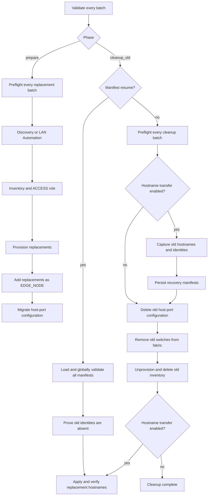

# Switch Refresh Use Case and Operator Guide

## Purpose

The `switch_refresh_sda_fabric_edge` role replaces multiple SDA edge switches in Cisco
Catalyst Center as a stage-batched workflow. It is intended for a planned
hardware refresh in which existing switches are replaced by new switches while
preserving fabric placement and host-port configuration.

Use the role when you need to:

- onboard several replacement switches through Discovery or LAN Automation;
- add all replacements to inventory with role `ACCESS`;
- provision them to the required site;
- add them to the fabric as `EDGE_NODE` devices;
- migrate port assignments and port-channel configuration from old to new
  switches;
- safely remove the old switches after physical cutover; and
- optionally give each replacement the hostname captured from its old switch.

The role accepts only the batch input model, `switch_refresh_sda_fabric_edge_batches`.

## Execution model

The role has two phases:

1. `prepare` onboards and configures the replacement switches.
2. `cleanup_old` removes the old switches and, when enabled, transfers their
   captured hostnames to the replacements.

The valid execution controls are:

| Operation | `switch_refresh_sda_fabric_edge_phase` | `switch_refresh_sda_fabric_edge_cleanup_old` | Hostname transfer enabled | Manifest resume |
|---|---|---:|---:|---:|
| Prepare replacements | `prepare` | `false` | optional | `false` |
| Normal cleanup without rename | `cleanup_old` | `true` | `false` | `false` |
| Normal cleanup and automatic rename | `cleanup_old` | `true` | `true` | `false` |
| Non-destructive hostname recovery | `cleanup_old` | `false` | `true` | `true` |

The role rejects every other combination before it changes Catalyst Center.



The diagram shows the normal all-stages-enabled path. Hostname capture,
manifest persistence, old-identity absence checks, and renaming run only when
`switch_refresh_sda_fabric_edge_hostname_transfer_enabled: true`. Each cleanup operation also
obeys its corresponding stage toggle.

All devices in one batch advance through each stage together. Workflow managers
receive the complete batch wherever they support multi-device input. Separate
entries in `switch_refresh_sda_fabric_edge_batches` are processed in list order, so devices
that must advance together should be placed in the same homogeneous batch.

This is stage batching, not a guarantee that every Catalyst Center API request
runs in a separate thread. A stage failure stops that batch before its next
stage. Catalyst Center workflow operations are not transactional.

## Prerequisites

Before using the role, confirm the following:

- The `cisco.catalystcenter` collection and a compatible Catalyst Center SDK
  are installed.
- The Ansible controller uses Python 3.9 or later.
- LAN Automation uses Python 3.12 or later, `ansible.utils`, and Catalyst Center
  SDK 3.1.6.0.2 or later.
- Catalyst Center and device credentials are stored in Ansible Vault or
  another secret store.
- Replacement management IPs, sites, serial numbers, and underlay pools are
  known.
- Old devices remain present and resolvable in Catalyst Center through prepare
  and normal cleanup preflight.
- Old devices are SDA `EDGE_NODE` devices in the batch fabric.
- The physical cutover and service validation are completed before
  `cleanup_old` is run.
- When hostname transfer is enabled, the Ansible controller has a persistent,
  writable manifest directory. Do not use `/tmp` for this directory.

## Files used by the operator

- [`playbooks/switch_refresh_sda_fabric_edge_prepare.yml`](../../playbooks/switch_refresh_sda_fabric_edge_prepare.yml)
  runs the prepare phase.
- [`playbooks/switch_refresh_sda_fabric_edge_cleanup_old.yml`](../../playbooks/switch_refresh_sda_fabric_edge_cleanup_old.yml)
  runs normal cleanup or manifest-based hostname recovery.
- [`playbooks/vars/switch_refresh_sda_fabric_edge_usecase.yml`](../../playbooks/vars/switch_refresh_sda_fabric_edge_usecase.yml)
  is the complete example variable file.
- [`README.md`](README.md) contains the full variable and schema reference.

Run the commands in this guide from the collection root.

When running directly from this source checkout rather than from an installed
collection, expose the directory that contains `ansible_collections` first:

```bash
cd /path/to/collections/ansible_collections/cisco/catalystcenter
export ANSIBLE_COLLECTIONS_PATH="$(pwd)/../../.."
```

## Store credentials securely

The example variable file refers to Vault-backed variables and contains no real
credentials. A separate encrypted file can contain values such as:

```yaml
vault_catalystcenter_host: catalyst-center.example.com
vault_catalystcenter_username: automation-user
vault_catalystcenter_password: replace-with-vault-secret
vault_switch_cli_username: network-admin
vault_switch_cli_password: replace-with-vault-secret
vault_switch_enable_password: replace-with-vault-secret
```

Create or edit it with Ansible Vault:

```bash
ansible-vault create /secure/path/switch_refresh_sda_fabric_edge_vault.yml
```

Pass it to the playbooks with `-e @/secure/path/switch_refresh_sda_fabric_edge_vault.yml` and
the appropriate Vault password option.

## Common configuration

The shared variable file should define the Catalyst Center connection, device
credentials, stage settings, and batches:

```yaml
catalystcenter_host: "{{ vault_catalystcenter_host }}"
catalystcenter_port: 443
catalystcenter_username: "{{ vault_catalystcenter_username }}"
catalystcenter_password: "{{ vault_catalystcenter_password }}"
catalystcenter_version: "2.3.7.9"
catalystcenter_verify: true
catalystcenter_debug: false
catalystcenter_log: false

switch_refresh_sda_fabric_edge_work_dir: /tmp/catalystcenter_switch_refresh_sda_fabric_edge

switch_refresh_sda_fabric_edge_inventory_credentials:
  username: "{{ vault_switch_cli_username }}"
  password: "{{ vault_switch_cli_password }}"
  enable_password: "{{ vault_switch_enable_password }}"
  cli_transport: ssh
  type: NETWORK_DEVICE

switch_refresh_sda_fabric_edge_device_info_lookup_enabled: true
switch_refresh_sda_fabric_edge_fabric_validation_enabled: true
switch_refresh_sda_fabric_edge_cleanup_inventory_enabled: true

switch_refresh_sda_fabric_edge_hostname_transfer_enabled: true
switch_refresh_sda_fabric_edge_hostname_transfer_resume_from_manifest: false
switch_refresh_sda_fabric_edge_hostname_transfer_manifest_dir: >-
  /var/lib/catalystcenter_switch_refresh_sda_fabric_edge/hostname_transfer
switch_refresh_sda_fabric_edge_hostname_transfer_timeout: 1200
switch_refresh_sda_fabric_edge_hostname_transfer_poll_interval: 10
switch_refresh_sda_fabric_edge_hostname_validation_retries: 12
switch_refresh_sda_fabric_edge_hostname_validation_interval: 10
```

Create the persistent manifest directory with ownership that allows the
Ansible controller account to write it. Use an appropriately scoped `become`
configuration if the chosen location requires elevated privileges.

For example, an administrator can prepare the path shown above for the current
controller account:

```bash
sudo install -d -m 0750 \
  -o "$(id -un)" -g "$(id -gn)" \
  /var/lib/catalystcenter_switch_refresh_sda_fabric_edge/hostname_transfer
```

Keep `switch_refresh_sda_fabric_edge_device_info_lookup_enabled: true` for production. Turning
it off requires every old mapping to use `management_ip` and skips the normal
replacement `ACCESS` inventory postcondition. Hostname transfer still performs
its mandatory live inventory lookups.

## Discovery onboarding example

Use Discovery when the replacement switches already have reachable management
IPs. Catalyst Center global credentials are used by the generated Discovery
configuration.

```yaml
switch_refresh_sda_fabric_edge_batches:
  - name: sjc-bldg23-edge-refresh
    fabric_site_name_hierarchy: Global/USA/San Jose/BLDG23
    onboarding_method: discovery

    new_devices:
      device_ips:
        - "192.0.2.20"
        - "192.0.2.21"

    device_mapping:
      - old:
          hostname: old-edge-01.example.test
        new_device_management_ip: "192.0.2.20"
        port_assignment_interface_mappings:
          - source_interface_name: GigabitEthernet1/0/5
            destination_interface_name: GigabitEthernet1/0/4
        port_channel_interface_mappings:
          - source_interface_name: GigabitEthernet1/0/47
            destination_interface_name: TenGigabitEthernet1/1/1

      - old:
          serial_number: OLD-SERIAL-0002
        new_device_management_ip: "192.0.2.21"
        port_assignment_interface_mappings: []
        port_channel_interface_mappings: []
```

The role generates Discovery input from `device_ips`. Discovery sets larger
than eight IPs are split into deterministic chunks. A complete custom
`new_devices.discovery_config` may be supplied instead, but its combined IP set
must exactly match `new_devices.device_ips`.

## LAN Automation onboarding example

Use LAN Automation when the replacements should be discovered through an
underlay automation session. One launch configuration can contain multiple
replacement devices.

```yaml
switch_refresh_sda_fabric_edge_batches:
  - name: sjc-bldg23-edge-refresh
    fabric_site_name_hierarchy: Global/USA/San Jose/BLDG23
    onboarding_method: lan_automation

    new_devices:
      device_ips:
        - "192.0.2.20"
        - "192.0.2.21"

      lan_automation_config:
        - lan_automation:
            discovered_device_site_name_hierarchy: >-
              Global/USA/San Jose/BLDG23
            primary_device_management_ip_address: "198.51.100.10"
            primary_device_interface_names:
              - GigabitEthernet2/0/7
            ip_pools:
              - ip_pool_name: LAN_AUTO_MAIN
                ip_pool_role: MAIN_POOL
              - ip_pool_name: LAN_AUTO_P2P
                ip_pool_role: PHYSICAL_LINK_POOL
            multicast_enabled: true
            redistribute_isis_to_bgp: false
            discovery_level: 5
            discovery_timeout: 40
            discovery_devices:
              - device_serial_number: NEW-SERIAL-0001
                device_site_name_hierarchy: >-
                  Global/USA/San Jose/BLDG23
                device_management_ip_address: "192.0.2.20"
              - device_serial_number: NEW-SERIAL-0002
                device_site_name_hierarchy: >-
                  Global/USA/San Jose/BLDG23
                device_management_ip_address: "192.0.2.21"
            launch_and_wait: true
            pnp_authorization: true

    device_mapping:
      - old:
          hostname: old-edge-01.example.test
        new_device_management_ip: "192.0.2.20"
        port_assignment_interface_mappings: []
        port_channel_interface_mappings: []

      - old:
          serial_number: OLD-SERIAL-0002
        new_device_management_ip: "192.0.2.21"
        port_assignment_interface_mappings: []
        port_channel_interface_mappings: []
```

The management IPs in `discovery_devices` must exactly match `device_ips`, and
`launch_and_wait` must be the Boolean `true`. After the LAN Automation manager
returns, the role requires two consecutive controller checks with no active LAN
Automation sessions before proceeding to inventory.

Discovery-device serial numbers must be unique across all selected LAN
Automation batches. Each `device_site_name_hierarchy` and
`discovered_device_site_name_hierarchy` must equal the batch fabric site.
Each LAN Automation batch must contain exactly one `lan_automation_config`
entry with between 1 and 50 `discovery_devices`.

## Mapping rules

`new_devices.device_ips` is the authoritative replacement set. For normal host
migration and cleanup, `device_mapping` must cover every replacement IP exactly
once.

Each mapping must:

- identify the old switch with exactly one `management_ip`, `hostname`,
  `serial_number`, or `mac_address` under `old`;
- point to one unique IP from `new_devices.device_ips`;
- keep `port_assignment_interface_mappings` and
  `port_channel_interface_mappings` separate; and
- use unique source and destination interfaces.

Unknown keys, duplicate old identifiers, duplicate destination interfaces,
partial mappings, old/new IP overlap, and cross-batch target collisions are
rejected before a replacement workflow starts.

## Optional custom workflow configurations

The role normally generates inventory, provisioning, and fabric-device input
from `device_ips`. Complete custom replacements may be supplied under
`new_devices`:

- `discovery_config`
- `inventory_config`
- `provision_config`
- `fabric_devices_config`

A custom configuration replaces the generated configuration for that stage.
It must cover exactly the declared replacement IP set. The role continues to
enforce the configured site, inventory role `ACCESS`, fabric role `EDGE_NODE`,
and safe merged-state behavior.

## Run the prepare phase

Prepare is non-destructive to the old switches:

```bash
ansible-playbook playbooks/switch_refresh_sda_fabric_edge_prepare.yml \
  --extra-vars @/secure/path/switch_refresh_sda_fabric_edge_vault.yml \
  --extra-vars '{"switch_refresh_sda_fabric_edge_hostname_transfer_resume_from_manifest": false}' \
  --ask-vault-pass
```

For every batch, the role:

1. validates every batch and mapping before any mutation;
2. resolves and validates every old migration source;
3. runs Discovery or LAN Automation for the replacement set;
4. adds replacements to inventory and enforces `ACCESS`;
5. provisions the replacements;
6. adds them to the fabric as `EDGE_NODE` devices;
7. revalidates old identities and fabric membership; and
8. generates and applies one aggregate host-port migration payload.

Successful batch results are appended to `switch_refresh_sda_fabric_edge_prepare_results` with
per-device status `prepared`.

## Validate and perform the physical cutover

Do not run cleanup immediately after prepare. First validate the operational
cutover, including:

- replacement reachability and inventory identity;
- inventory role `ACCESS`;
- expected fabric and `EDGE_NODE` membership;
- provisioning status;
- migrated port assignments and port channels;
- endpoint connectivity and application health; and
- rollback readiness.

The role does not move cables or validate external DNS, DHCP, ISE, monitoring,
certificate, or CMDB dependencies.

## Run normal cleanup

After the cutover is accepted, run:

```bash
ansible-playbook playbooks/switch_refresh_sda_fabric_edge_cleanup_old.yml \
  --extra-vars @/secure/path/switch_refresh_sda_fabric_edge_vault.yml \
  --extra-vars '{"switch_refresh_sda_fabric_edge_hostname_transfer_resume_from_manifest": false}' \
  --ask-vault-pass
```

The cleanup playbook explicitly authorizes destructive cleanup. Before any
deletion, the role preflights every selected batch. When hostname transfer is
enabled, it also captures the old hostname and immutable old/new identities and
writes a mode-`0600` manifest for every batch.

With all cleanup stages and hostname transfer enabled, cleanup then:

1. removes old host-port configuration;
2. removes the old switches from the fabric and proves absence;
3. unprovisions the old switches;
4. removes them from inventory;
5. proves their IP, UUID, and expanded stack serial identities are absent;
6. submits one aggregate LAN Automation hostname update per batch for
   replacements that currently require a change; and
7. reconciles inventory and fabric state before reporting success.

Successful cleanup results are appended to `switch_refresh_sda_fabric_edge_cleanup_results`.
When hostname transfer is enabled, successful batches report
`cleaned_and_hostname_verified`.

## How hostname transfer works

The desired hostname is never taken from `new_devices`. During cleanup
preflight, the role reads each old switch's live hostname from Catalyst Center
and captures:

- old management IP, hostname, UUID, and serial number;
- replacement management IP, UUID, serial number, current hostname, inventory
  role, management state, and reachability state; and
- the batch, fabric site, controller, and input fingerprint.

Before deletion, the role verifies that every desired hostname belongs only to
its mapped old device. Before applying the name, it rechecks live hostname
ownership, proves the old identities are absent, and verifies that the
replacement is still the captured device, is Managed, reports `Reachable` or
`Ping Reachable`, has inventory role `ACCESS`, and is an `EDGE_NODE` in the
expected fabric.

Hostname finalization uses the LAN Automation
`lan_automated_device_update.hostname_update_devices` operation regardless of
whether the replacement was originally onboarded by Discovery or LAN
Automation. It does not start another LAN Automation discovery session.

The update is submitted as one aggregate, update-only payload per batch.
Devices whose hostnames are already correct are skipped. Hostname comparison is
case-insensitive because Catalyst Center may normalize hostname case.

The manifest and final convergence check retain the complete hostname captured
from the old device. The LAN Automation request submits only its leftmost host
label; Catalyst Center and the device domain configuration provide the DNS
suffix. For example, a captured `old-edge-01.example.test` is submitted as
`old-edge-01`, preventing a duplicated `.example.test.example.test` suffix.
If the replacement uses a different DNS domain, exact FQDN convergence fails
safely because this role does not change device or site DNS-domain settings.

Hostname transfer supports at most 100 mappings in one batch. It does not
update external DNS, DHCP, ISE, monitoring, certificates, or CMDB records.

## Manifest resume and non-destructive hostname recovery

These terms describe two parts of the same recovery path:

- **Manifest resume** is the mechanism that reloads the old-to-new hostname and
  identity data captured before deletion. The manifest records the controller,
  batch, fabric site, input fingerprint, overall progress, and each mapped old
  and replacement device's hostname, management IP, UUID, serial identity, and
  per-device status.
- **Non-destructive hostname recovery** is the execution mode that uses those
  manifests to retry or verify only replacement-hostname finalization. It does
  not remove host-port configuration, remove fabric membership, unprovision a
  device, or delete an inventory record. It can still change the hostname of a
  validated replacement device.

Normal hostname-enabled cleanup follows this sequence:

1. Capture and persist every selected batch manifest before the first
   destructive batch starts.
2. Remove the old switches through the configured cleanup stages.
3. Apply and verify the captured hostnames on the mapped replacements.

If step 3 fails after the old inventory records were deleted, the old
hostnames can no longer be queried from Catalyst Center. The persisted
manifests become the recovery source. Do not rerun destructive cleanup; run
the same `cleanup_old` phase in manifest-resume mode:

```yaml
switch_refresh_sda_fabric_edge_phase: cleanup_old
switch_refresh_sda_fabric_edge_cleanup_old: false
switch_refresh_sda_fabric_edge_hostname_transfer_enabled: true
switch_refresh_sda_fabric_edge_hostname_transfer_resume_from_manifest: true
```

With the provided cleanup playbook, the resume flag derives
`switch_refresh_sda_fabric_edge_cleanup_old: false`. Direct role callers must set it explicitly.
The role rejects `resume=true` together with destructive cleanup approval
before any controller mutation.

Run the recovery with:

```bash
ansible-playbook playbooks/switch_refresh_sda_fabric_edge_cleanup_old.yml \
  --extra-vars @/secure/path/switch_refresh_sda_fabric_edge_vault.yml \
  --extra-vars '{"switch_refresh_sda_fabric_edge_hostname_transfer_enabled": true, "switch_refresh_sda_fabric_edge_hostname_transfer_resume_from_manifest": true}' \
  --ask-vault-pass
```

Use JSON extra-vars as shown so `true` is passed as a Boolean rather than a
string. Keep the original batch definitions and the same manifest directory.
The manifest fingerprint binds the batch name, fabric site, sorted replacement
IP set, and `device_mapping`. The controller and captured device identities are
validated separately. The onboarding method and optional workflow
configurations are not part of that fingerprint.

Resume mode:

1. loads and validates every selected manifest before the first update,
   requiring a regular, non-symlink file with exact mode `0600`;
2. verifies controller, batch, site, fingerprint, device coverage, UUIDs, and
   serial numbers;
3. proves the old identities are absent;
4. reclassifies every replacement from live inventory instead of trusting its
   persisted progress status;
5. skips currently correct replacements and updates only devices that still
   require a hostname change; and
6. persists the reconciled result.

Resume fails closed if an old device remains, a replacement identity changed,
a hostname is owned by another device, the manifest does not match the current
input, or fabric/inventory eligibility cannot be proven.

Manifest resume is hostname-only recovery. It cannot repair a partially
completed destructive cleanup batch whose old inventory records are in mixed
states. Select only batches for which old inventory deletion completed.

After old inventory deletion, the manifest is the only role-managed source of
the captured hostname and old/new identities. A missing, corrupt, mismatched,
or incorrectly permissioned manifest cannot be reconstructed by the role.

## Stage controls

Prepare and shared stage controls are:

- `switch_refresh_sda_fabric_edge_discovery_enabled`
- `switch_refresh_sda_fabric_edge_lan_automation_enabled`
- `switch_refresh_sda_fabric_edge_inventory_enabled`
- `switch_refresh_sda_fabric_edge_inventory_role_update_enabled`
- `switch_refresh_sda_fabric_edge_provision_enabled`
- `switch_refresh_sda_fabric_edge_fabric_add_enabled`
- `switch_refresh_sda_fabric_edge_fabric_validation_enabled`
- `switch_refresh_sda_fabric_edge_host_onboarding_enabled`

Cleanup controls are:

- `switch_refresh_sda_fabric_edge_cleanup_host_onboarding_enabled`
- `switch_refresh_sda_fabric_edge_cleanup_fabric_enabled`
- `switch_refresh_sda_fabric_edge_cleanup_unprovision_enabled`
- `switch_refresh_sda_fabric_edge_cleanup_inventory_enabled`

Stage toggles apply to the complete role invocation. Disabling a stage means
its required Catalyst Center postcondition already exists; it does not remove
the dependency. In particular:

- normal hostname transfer requires
  `switch_refresh_sda_fabric_edge_cleanup_inventory_enabled: true`;
- unprovisioning or inventory deletion requires fabric removal in the current
  run or exact fabric-absence proof with validation enabled;
- replacement fabric validation remains independent of
  `switch_refresh_sda_fabric_edge_fabric_add_enabled`; and
- `switch_refresh_sda_fabric_edge_allow_empty_host_port_config: true` permits only a completely
  empty generated payload. A non-empty partial payload is always rejected.

## Recover from a partial prepare or cleanup stage

Prepare workflow operations are idempotent but not transactional. After fixing
the cause of a partial prepare failure, rerun prepare. A completed stage may be
disabled only when its required Catalyst Center postcondition already exists.

If fabric removal completed but a later cleanup stage failed, rerun only the
unfinished batches with the following controls. Disable host-port cleanup only
if that stage is also known to have completed:

```yaml
switch_refresh_sda_fabric_edge_cleanup_host_onboarding_enabled: false
switch_refresh_sda_fabric_edge_cleanup_fabric_enabled: false
switch_refresh_sda_fabric_edge_fabric_validation_enabled: true
switch_refresh_sda_fabric_edge_cleanup_unprovision_enabled: true
switch_refresh_sda_fabric_edge_cleanup_inventory_enabled: true
```

When hostname transfer was enabled for the original cleanup, preserve the
original full-batch manifest before a reduced cleanup rerun. Set
`switch_refresh_sda_fabric_edge_hostname_transfer_enabled: false` for that reduced destructive
rerun so it cannot overwrite the manifest with only the remaining mappings.
After every old identity from the original batch is absent, restore the
original complete `switch_refresh_sda_fabric_edge_batches` input and retained manifest, then
run manifest recovery with hostname transfer and
`switch_refresh_sda_fabric_edge_hostname_transfer_resume_from_manifest` both set to `true`.

Disabling cleanup fabric removal while leaving fabric validation enabled makes
the role prove the selected old devices are already absent before it proceeds.
Include only old identities that are still present when recovering from partial
inventory deletion. Remove fully completed batches from normal-cleanup rerun
input because their deleted inventory identities can no longer be resolved by
cleanup preflight.

If an aggregate stage succeeded for only part of a batch, split the rerun input
by actual controller state. Do not mix old devices that are still present in
the fabric with devices already removed from it in the same recovery run.

## Result facts and generated files

The role records:

- `switch_refresh_sda_fabric_edge_prepare_results`: per-batch and per-device prepare status;
- `switch_refresh_sda_fabric_edge_cleanup_results`: cleanup and hostname verification status;
  and
- `switch_refresh_sda_fabric_edge_hostname_transfer_results`: submitted, pending, and verified
  hostname-transfer state.

Generated files include:

- aggregate host-port migration payloads under `switch_refresh_sda_fabric_edge_work_dir` or a
  per-batch absolute `migration_output_file`;
- aggregate old-host cleanup payloads under `switch_refresh_sda_fabric_edge_work_dir` or a
  per-batch absolute `old_host_port_cleanup_file`; and
- durable hostname-transfer manifests under
  `switch_refresh_sda_fabric_edge_hostname_transfer_manifest_dir`.

Generated output paths must be absolute. Existing directories, symlinks, and
special files are never treated as replaceable output files.

## Operator checklist

Before `prepare`:

- [ ] Store credentials outside the plain-text variable file.
- [ ] Verify every replacement IP and old-to-new mapping.
- [ ] Verify batch site and onboarding method.
- [ ] Verify LAN Automation pools, seed interfaces, serial numbers, and sites.
- [ ] Confirm the manifest directory is persistent and writable when hostname
      transfer is enabled.

Before `cleanup_old`:

- [ ] Confirm prepare completed for every replacement.
- [ ] Confirm physical cutover and endpoint/application validation.
- [ ] Confirm each replacement is the expected `ACCESS`/`EDGE_NODE` device.
- [ ] Confirm rollback and external-system plans.
- [ ] Verify and protect the persistent manifest directory, and retain any
      existing manifests from an earlier attempt.

After cleanup:

- [ ] Confirm old devices are absent from fabric and inventory.
- [ ] Confirm replacement hostnames and management reachability.
- [ ] Retain or back up the manifests written during cleanup until the refresh
      is fully accepted.
- [ ] Update DNS, DHCP, ISE, monitoring, certificates, and CMDB records where
      required.
- [ ] Remove manifests only after the refresh and external-system updates are
      fully accepted and the applicable retention policy permits it.

## Additional reference

For the complete schema, custom payload restrictions, stage toggles, and
failure-recovery details, see [`README.md`](README.md).
